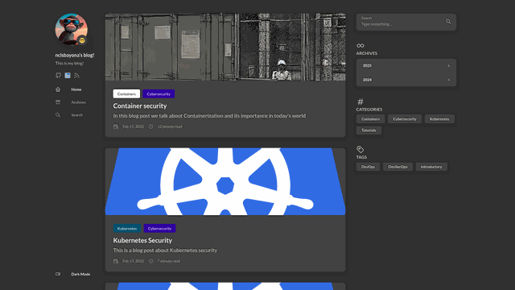

# [nclsbayona.github.io](https://nclsbayona.github.io)

[](https://github.com/nclsbayona/nclsbayona.github.io/actions/workflows/deploy.yml)
[](https://github.com/nclsbayona/nclsbayona.github.io/actions/workflows/semantic-release.yml)
[](https://nclsbayona.github.io)

A personal blog focused on cloud-native technologies, software development, DevOps, security, and modern software architecture. Content is posted when there's relevant information to share about development best practices, tools, and methodologies.



## 🚀 Quick Start

### Prerequisites

- **Hugo Extended** v0.115.0+ ([Installation Guide](https://gohugo.io/installation/))
- **Go** v1.17+ ([Installation Guide](https://go.dev/doc/install))
- **Git**

### Local Development

```bash
# Clone the repository
git clone https://github.com/nclsbayona/nclsbayona.github.io.git
cd nclsbayona.github.io

# Initialize Hugo modules
hugo mod get -u
hugo mod tidy

# Start development server
hugo server -D

# Build for production
hugo --minify
```

Visit `http://localhost:1313` to see the site locally.

## 📚 Documentation

Comprehensive documentation is available for all aspects of the project:

- **[DEVELOPMENT.md](DEVELOPMENT.md)** - Local setup, project structure, common tasks
- **[CONTRIBUTING.md](CONTRIBUTING.md)** - Contribution guidelines, commit conventions, PR process
- **[.github/workflows/README.md](.github/workflows/README.md)** - Workflow architecture and CI/CD documentation
- **[config/README.md](config/README.md)** - Configuration files and Hugo settings
- **[scripts/README.md](scripts/README.md)** - Utility scripts documentation

## 🛠️ Technology Stack

- **Static Site Generator**: [Hugo](https://gohugo.io/) (Extended)
- **Theme**: [Stack](https://github.com/CaiJimmy/hugo-theme-stack) v3
- **Hosting**: GitHub Pages
- **CI/CD**: GitHub Actions
- **Version Control**: Git with Conventional Commits
- **Languages**: Go, Markdown, TOML, SCSS

## 📂 Project Structure

```
nclsbayona.github.io/
├── .github/           # GitHub Actions workflows and documentation
├── assets/            # Source assets (SCSS, icons)
├── config/            # Hugo configuration files
├── content/           # Blog posts and pages
│   ├── post/         # Blog posts by category
│   └── page/         # Static pages (about, archives, quote)
├── layouts/           # Custom Hugo layouts
├── scripts/           # Utility scripts (Go)
├── CHANGELOG.md       # Auto-generated changelog
├── CONTRIBUTING.md    # Contribution guidelines
├── DEVELOPMENT.md     # Development guide
└── README.md          # This file
```

## ✨ Features

### Content
- 📝 Technical blog posts on software development and DevOps
- 🏷️ Category and tag-based organization
- 🔍 Full-text search capability
- 💬 GitHub-based comments (utterances)
- 📅 Daily inspirational quotes

### Technical
- ⚡ Fast static site generation with Hugo
- 🎨 Responsive design with dark/light mode
- 🔒 Security scanning (Gitleaks, Trivy, ZAP)
- 📊 Performance monitoring (Lighthouse)
- 🤖 Automated deployments via GitHub Actions
- 🔄 Automated dependency updates (Dependabot)
- 📋 Semantic versioning and changelog generation

## 🔄 Automated Workflows

The repository uses GitHub Actions for automation:

### Deployment & Content
- **Deploy**: Builds and deploys to GitHub Pages on content changes
- **Quote Update**: Daily quote refresh at 02:00 UTC
- **Theme Update**: Daily theme dependency updates

### Quality & Security
- **Security Test**: Vulnerability scanning (Gitleaks, Trivy, ZAP, zizmor)
- **Page Analysis**: Performance testing with Lighthouse and Sitespeed
- **Semantic Release**: Automated versioning and changelog generation

### Maintenance
- **Auto-merge**: Automatic dependency PR merges for minor/patch updates
- **Cleanup**: Daily workflow run cleanup
- **Demo GIF**: Generates demo.gif for repository visualization

See [.github/README.md](.github/README.md) for detailed workflow documentation.

## 🤝 Contributing

Contributions are welcome! Please follow these steps:

1. **Read the guidelines**: Review [CONTRIBUTING.md](CONTRIBUTING.md)
2. **Set up locally**: Follow [DEVELOPMENT.md](DEVELOPMENT.md)
3. **Create a branch**: Use conventional commit format
4. **Make changes**: Follow code and content standards
5. **Test locally**: Build and review changes
6. **Submit PR**: Include clear description and testing notes

### Commit Convention

This project follows [Conventional Commits](https://www.conventionalcommits.org/):

```
feat(post): add kubernetes security best practices guide
fix(workflow): correct Hugo version pinning
docs(readme): update setup instructions
chore(deps): update hugo-theme-stack to v3.34.1
```

## 📖 Blog Topics

Content focuses on:

- **DevOps & DevSecOps**: Best practices, tools, and methodologies
- **Cloud-Native**: Kubernetes, containers, microservices
- **Security**: Application security, container security, security practices
- **Software Development**: Clean code, architecture, design patterns
- **Tools & Techniques**: Developer productivity and workflow optimization

## 🔐 Security

- Security scanning integrated into CI/CD pipeline
- Regular dependency updates via Dependabot
- Vulnerability detection with Gitleaks, Trivy, and ZAP
- GitHub Actions security linting with zizmor

To report security issues, please use GitHub's private vulnerability reporting.

## 📄 License

This project is licensed under the terms specified in the [LICENSE](LICENSE) file.

## 📞 Contact

- **Blog**: [nclsbayona.github.io](https://nclsbayona.github.io)
- **GitHub**: [@nclsbayona](https://github.com/nclsbayona)

## 🙏 Acknowledgments

- **Hugo**: Static site generator framework
- **Stack Theme**: Beautiful and functional Hugo theme by [@CaiJimmy](https://github.com/CaiJimmy)
- **GitHub Pages**: Free hosting for static sites
- **GitHub Actions**: Powerful CI/CD automation

---

<details>
  <summary><h2>📊 All Workflow Status Badges</h2></summary>
  
  ### Webpage Related
  
  #### Content & Deployment
  
  
  
  
  
  #### User Experience
  
  
  ### Repository Related
  
  
  
  
  
</details>

---

**Built with ❤️ and Hugo**