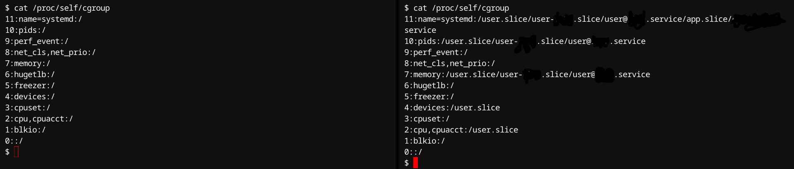

## Containerization Internals

You might be wondering, **Containers are already integral to my workflow, so why delve deeper into their intricacies?** That's entirely understandable, not everyone desires an exhaustive technical understanding and that's ok. However, this post aims precisely at readers who seek clarity on how this *~magic~* actually works.

A quick mention on this topic is that I already wrote a post on containers. So if you want an overview of containerization or you just want a quick refresh on what I am talking about, go [check that out first](/p/containers-intro). Having said that and without any further talking lets get right to what we came here for.

### Technical introduction

I personally think that to understand something, it's useful to see what is behind that (The *Why?* something is the way it is). And yeah, you can argue *That's almost impossible because that means you will have to understand people* and really people are dynamic creatures in their nature so that means basically controlling the chaos but If you're like me, you would say *Yes, but in any case I'll try*.

So, containers as we know (and use) actually evolved from several decades of technological developments in virtualization, isolation, and resource management. Although popularized primarily by Docker in the 2010s, its roots trace back several decades. Lets go quickly through some of those deveelopments that make containerization technologies work as they do in today's world.

#### Early Developments and Origins

- [Chroot (1979)](https://en.wikipedia.org/wiki/Chroot): Unix introduced the concept of chroot, allowing processes to operate with a separate root filesystem. This laid foundational ideas around isolation and encapsulation.

- [FreeBSD Jails (2000)](https://papers.freebsd.org/2000/phk-jails.files/sane2000-jail.pdf): The FreeBSD operating system expanded on these concepts, introducing Jails, which provided process and network isolation, giving administrators a lightweight alternative to full virtualization.

#### Advancements in Linux Isolation Mechanisms

- [Linux Namespaces (2002)](https://link.springer.com/book/10.1007/978-1-4842-6283-2): Namespaces provide processes with an isolated view of system resources. When processes run inside a namespace, they perceive their environment as dedicated and separate from others, enhancing both security and stability.

- [Control Groups (cgroups) (2007)](https://link.springer.com/book/10.1007/978-1-4842-6283-2): Google engineers developed Control Groups (cgroups) to limit resource consumption (CPU, memory, disk I/O) of Linux processes. This contributed significantly to the modern form of containers by adding resource management and control capabilities.

#### Emergence of Modern Containers

[Linux Containers (LXC) (2008)](https://ieeexplore.ieee.org/document/7095802):

Built on namespaces and cgroups, LXC introduced full-fledged Linux containers, providing comprehensive lightweight virtualization that avoided the overhead of virtual machines (VMs).

[Docker (2013)](https://dl.acm.org/doi/10.5555/2600239.2600241):

Docker simplified containerization by providing intuitive tooling and standard image formating, leading to widespread adoption in industry and the open-source community. Docker significantly lowered the barriers to entry for using container technology.

### Benefits of the Creation of Containers

So, given that technical review of the specific developments that made container technologies possible, we can now see some benefits of those.

#### **Lightweight Virtualization Alternative**

Containers were introduced primarily as a solution to virtualization overhead. Unlike traditional VMs, containers share the host operating system kernel, resulting in reduced memory footprint, faster startup, and improved resource efficiency.

#### Improved Application Portability

Containers package applications and dependencies together into a single consistent unit, enabling seamless deployment across various computing environments. This portability greatly streamlined development-to-production workflows, encapsulating dependencies and minimizing compatibility issues ("it works on my machine" problem).

#### Resource Isolation and Security

Containers leverage isolation techniques such as namespaces and cgroups, providing secure multi-tenancy. This means multiple applications can run independently on the same host without interference, enhancing security and reliability.

#### Scalability and Rapid Deployment

Containers facilitate microservice-based architectures by enabling rapid scaling, deployment, and updates. Technologies such as Kubernetes further expanded on this by automating container orchestration, deployment, and scaling, making containers the backbone of modern scalable applications.

### Namespaces

I know we already saw that namespaces are a technology that provide processes with an isolated view of the system and really that's basically it but I wanted to expand more on those because of their importance on containers. So, just as a quick introduction on what we saw, Linux namespaces emerged as a practical solution to isolation, security, and lightweight virtualization demands unique to Linux’s architecture and ecosystem.

There are multiple namespace types (That target different parts of a system) so each namespace type contributes specific isolation capabilities, forming the backbone of modern containerization technologies like Docker, Kubernetes, and LXC.

The following table describes namespaces in a more detailed way:

| Namespace Type | Description                                                | Example Usage                              |
|----------------|------------------------------------------------------------|--------------------------------------------|
| PID            | Isolates process IDs; separate PID hierarchy               | Containers run isolated processes          |
| Mount          | Separate filesystem mounts; isolated filesystem view       | Unique file-system per container           |
| Network        | Isolates network interfaces, IP addresses, routing tables  | Independent networking stacks per container|
| IPC            | Isolates System V IPC and POSIX message queues             | Prevent inter-container IPC communication  |
| UTS            | Isolated hostnames and domain names                        | Distinct hostnames per container           |
| User           | Isolated user and group ID spaces                          | Independent user-IDs per container         |
| Cgroup         | Controls visibility of cgroup hierarchy                    | Container’s isolated view of cgroups       |
| Time (newer)   | Separate system clocks per namespace                       | Independent time settings per container    |

#### **PID Namespace**

**Purpose**: Isolate process IDs, enabling separate PID hierarchies.

**Kernel Flag**: ```CLONE_NEWPID```

**Internal Mechanism**: PID namespaces create independent process hierarchies by maintaining separate PID tables in the kernel so When a process in a PID namespace creates a child, the kernel assigns process IDs local to that namespace. PID 1 inside the namespace becomes the "init process," handling orphan processes and signals internally.


**Typical Use**:

- Container processes are completely isolated from host process lists.
- Prevents containers from signaling or influencing external processes.

#### **Mount Namespace**

**Purpose**: Isolate filesystem mount points.

**Kernel Flag**: ```CLONE_NEWNS```

**Internal Mechanism**: The kernel maintains independent mount tables for each namespace so a process sees and manipulates its namespace’s mount table, ensuring isolated filesystem views. Using this, filesystem operations (mount, umount) inside the namespace do not propagate to other namespaces unless explicitly allowed by mount propagation settings.


**Typical Use**:

- Containers have isolated filesystem hierarchies.
- Safe testing of filesystem operations.

#### **Network Namespace**

**Purpose**: Isolates network resources (interfaces, IPs, routing tables).

**Kernel Flag**: ```CLONE_NEWNET```

**Internal Mechanism**: Each network namespace has a separate copy of kernel network structures like network devices (net_device), IP routing tables
Firewall rules (netfilter/IPTables), Socket buffers and TCP/UDP ports so that kernel routing logic dispatches network packets exclusively within their namespace context.


**Typical Use**:

- Containerized network environments.
- Virtual network stacks for isolated network experiments or secure applications.

#### **IPC Namespace**

**Purpose**: Isolate inter-process communication mechanisms (System V IPC, POSIX queues).

**Kernel Flag**: ```CLONE_NEWIPC```

**Internal Mechanism**: Separate kernel IPC structures (message queues, shared memory segments, semaphores) created per namespace in a way that resource IDs are unique and local to each namespace. So that processes can access IPC resources isolated from other namespaces, preventing unintended communication or collisions.


**Typical Use**:

- Containers running isolated IPC-intensive applications.
- Secure multi-tenant application hosting.

#### **UTS Namespace**

**Purpose**: Isolate hostnames and domain names.

**Kernel Flag**: ``CLONE_NEWUTS``

**Internal Mechanism**: The kernel provides isolated copies of UTSname data structure per namespace. So that when processes query the hostname via uname() syscall or /proc/sys/kernel/hostname they see namespace-specific values.


**Typical Use**:

- Applications requiring different hostnames in containers.
- Isolating configuration management per environment.

#### **User Namespace**

**Purpose**: Isolate user and group IDs, enabling privilege isolation.

**Kernel Flag**: ```CLONE_NEWUSER```

**Internal Mechanism**: Kernel maintains user and group ID mappings (uid_map, gid_map) per namespace. In a way that processes inside namespaces can have root (uid=0) privileges internally while mapping to unprivileged IDs externally. This way, system calls performing security checks validate permissions using namespace-specific mappings, significantly improving security.


**Typical Use**:

- Containers with root-like privileges without compromising host security.
- Securely running untrusted or third-party applications.

#### **Cgroup Namespace**

**Purpose**: Isolate visibility and interaction with cgroup hierarchies.

**Kernel Flag**: ```CLONE_NEWCGROUP```

**Internal Mechanism**: Kernel maintains independent cgroup filesystem views per namespace, which limits information exposure about host resource limits or other containers. This allows for distinct resource management configurations per container/namespace without exposing sensitive host details.



**Typical Use**:

- Containers with isolated resource allocation views.
- Secure multi-tenant resource monitoring.

#### Time Namespace (Kernel ≥ 5.6)

**Purpose**: Isolate system clock views per namespace.

**Kernel Flag**: ```CLONE_NEWTIME```

**Internal Mechanism**: The kernel maintains namespace-specific offsets from the global clock which allows system calls like clock_gettime() return namespace-adjusted times. This allows independent system clock modifications, ensuring applications perceive different current times.


**Typical Use**:

- Testing time-dependent applications.
- Running legacy software requiring specific time settings.

#### Summary table (Namespaces)

| Namespace | Kernel Flag     | Kernel Structures Isolated                 | Typical Uses                                      |
|-----------|-----------------|--------------------------------------------|---------------------------------------------------|
| PID       | CLONE_NEWPID    | PID tables, process hierarchies            | Containerized processes, debugging isolation      |
| Mount     | CLONE_NEWNS     | Filesystem mount points (mount tables)     | Isolated file systems, container storage          |
| Network   | CLONE_NEWNET    | Network devices, IP tables, routing tables | Virtual networking, container isolation           |
| IPC       | CLONE_NEWIPC    | System V IPC, POSIX message queues         | Multi-tenant IPC, containers                      |
| UTS       | CLONE_NEWUTS    | Hostnames, domain names (`utsname`)        | Application-specific hostnames, container config  |
| User      | CLONE_NEWUSER   | UID/GID mappings, privilege checks         | Secure containers, privilege isolation            |
| Cgroup    | CLONE_NEWCGROUP | Cgroup filesystem and hierarchy            | Resource management isolation, secure multi-tenancy |
| Time      | CLONE_NEWTIME   | System clock offsets                       | Testing software, legacy application support      |

**Note**: Each namespace type offers distinct isolation, reinforcing container security and flexibility.

### Cgroups

Just like namespaces, we already saw what cgroups are and you might be thinking *well, cgroups are just for limiting resources a process (or a group of them) can actually access* and yes that's a good explanation. However just like with namespaces I wanted to give more details on cgroups given their importance in containerization technologies.

Cgroups exist in two different versions:

- Cgroups v1 (legacy): Uses separate hierarchies per subsystem.
(Widely used, e.g., Docker uses cgroups v1 by default.)
**Key Characteristics of v1**:
Multiple hierarchies, each controller mounts separately.
Complex and fragmented management (each controller has independent trees).
Widely supported by legacy applications and container runtimes (Docker pre-20.x, older Kubernetes clusters).

- Cgroups v2 (unified): Single unified hierarchy, simplifies management and provides advanced features like resource pressure notifications.
(Recommended going forward; Kubernetes now supports v2.)

| Aspect | cgroups v1 (Legacy)     | cgroups v2 (Unified) |
|-----------|-----------------|----------|
| Hierarchy Structure | Multiple separate hierarchies (per controller) | Single unified hierarchy |
| Complexity | Higher complexity, fragmentation | Simpler, consistent management |
| Resource Controllers | Independently mounted controllers | Controllers explicitly enabled |
| Process Assignment | Tasks assigned via tasks file per-controller | Unified cgroup.procs for all controllers |
| Resource Pressure Metrics | Limited support | Improved pressure monitoring (memory.pressure)|
| Delegation Support | Complex delegation model | Improved and simplified delegation |
| Adoption and Compatibility | Broad, legacy support | Growing adoption; Kubernetes and Podman support v2 |

So, cgroups are managed under the ```/sys/fs/cgroup``` directory. Again, just like namespaces there are cgroups specialized in a specific task. Next we'll go through the major cgroups (The most used ones at least. Please note that examples are provided for Cgroups v1 but the recommended version to use is v2 ):

#### **CPU Controller (cpu)**

**Purpose**: Manages CPU time allocation and scheduling priority.

**Key Parameters**:

- cpu.shares: Relative CPU time allocation (default: 1024).
- cpu.cfs_quota_us: Limits total CPU time in microseconds within a period.
- cpu.cfs_period_us: Defines the period of CPU time allocation.

**Example**:
Limit a cgroup to use only half of a single CPU:

```bash
echo 50000 > /sys/fs/cgroup/cpu/mygroup/cpu.cfs_quota_us
echo 100000 > /sys/fs/cgroup/cpu/mygroup/cpu.cfs_period_us
```

#### **CPU Set Controller (cpuset)**

**Purpose**: Assigns processes to specific CPU cores and NUMA memory nodes.

**Key Parameters**:

- cpuset.cpus: List of CPUs assigned to processes in this cgroup.
- cpuset.mems: Specifies NUMA memory nodes.

**Example**:
Assign processes to CPUs 0-3:

```bash
echo "0-3" > /sys/fs/cgroup/cpuset/mygroup/cpuset.cpus
echo "0" > /sys/fs/cgroup/cpuset/mygroup/cpuset.mems
```

#### **Memory Controller (memory)**

**Purpose**: Manages and restricts physical RAM and swap usage.

**Key Parameters**:

- memory.limit_in_bytes: Maximum memory usage allowed.
- memory.swappiness: Defines how aggressively swap is used.

**Example**:
Limit cgroup memory to 512 MB:

```bash
echo 536870912 > /sys/fs/cgroup/memory/mygroup/memory.limit_in_bytes
```

#### **Block I/O Controller (blkio)**

**Purpose**: Limits and prioritizes disk I/O.

**Key Parameters**:

- blkio.weight: Relative weight for block I/O (default 500).
- blkio.throttle.read_bps_device: Limits read rate (bytes/sec).
- blkio.throttle.write_bps_device: Limits write rate.

**Example**:
Limit disk write speed:

```bash
echo "8:0 10485760" > /sys/fs/cgroup/blkio/mygroup/blkio.throttle.write_bps_device # (Limits writes to 10MB/s for block device 8:0)
```

#### **Device Controller (devices)**

**Purpose**: Controls access to device nodes (e.g., /dev/*).

**Key Parameters**:

- devices.allow / devices.deny: Controls allowed or blocked device operations.

Example:
Allow read-write access to /dev/null only:

```bash
echo "a *:* rwm" > /sys/fs/cgroup/devices/mygroup/devices.deny
echo "c 1:3 rwm" > /sys/fs/cgroup/devices/mygroup/devices.allow
# (c: character device, 1:3 device ID for /dev/null)
```

#### **PIDs Controller (pids)**

**Purpose**: Limits the number of processes a cgroup can spawn.

**Key Parameter**:

- pids.max: Maximum allowed processes.

**Example**:
Limit processes to 100:

```bash
echo 100 > /sys/fs/cgroup/pids/mygroup/pids.max
```

#### **Freezer Controller (freezer)**

**Purpose**: Suspends (freezes) and resumes processes in a cgroup.

**Key Parameter**:

- freezer.state: (FROZEN / THAWED)

**Example**:
Pause all processes temporarily:

```bash
echo FROZEN > /sys/fs/cgroup/freezer/mygroup/freezer.state
```

#### Summary table (Cgroups)

| Subsystem | Purpose                                     | Practical Application                          |
|-----------|---------------------------------------------|------------------------------------------------|
| cpu       | Controls CPU scheduling and allocation      | Limit CPU usage per container                  |
| memory    | Manages RAM and swap usage                  | Set container memory limits                    |
| blkio     | Limits disk I/O bandwidth                   | Prevent disk bottlenecks                       |
| devices   | Controls access permissions to devices      | Restrict container hardware access             |
| cpuset    | Limits execution to specific CPU cores      | Assign dedicated CPU cores                     |
| freezer   | Enables pausing and resuming processes      | Suspend and resume workloads                   |
| net_cls   | Classifies network packets for QoS          | Prioritize network traffic per container       |
| pids      | Limits number of process identifiers (PIDs) | Prevent PID exhaustion on host system          |

**Note**: Each cgroup type allows for control of an specific resource. Having the ability of controlling resources an specific process or group has acces to is crucial to containerization.

### Container creation / management

Ok, we already went through a lot of technical stuff regarding deep internal working of containers but now you might be thinking *How does this actually work? I mean, I don't remember I have to create a namespace and/or a cgroup everytime I want to run a container* and that's right. Don't rush, we'll see that just now.

So actually running a container involves different components. We have a user facing CLI (Actually this is optional but its nice to have one, you could just mimic the behavior of the CLI  because most of them just send network commands but again, its nice to have a CLI), we have a container engine (The one in charge of managing the lifecycle of containers, this can rely on other tools for its tasks (Example image management, storage, networking, etc.)) and a container runtime (The one that actually does the job).

### Containers on other platforms

Now, after that you might probably think *Hey, this guy's telling me that containers depend on technologies present in the Linux Kernel only, but I do run my beloved containers using my Mac/Windows machine so its a nonsense to keep reading this!* and fear not my beloved melodramatic friend, I've got your back.

So, just as a quick catch-up [virtualization](https://www.ibm.com/think/topics/virtualization) exists, this allows machines to simulate virtually something that does not physically exist, for example you can simulate you have an ARM processor but really you have a x86 one (Really cool, huh!), so you could also simulate complete OSs with all their libraries and dependencies, this allows to even simulate network hardware (You are right, you can't simulate things out of nothing so you need to have compatible hardware to do so) and really imagination is the limit here.

That works as a long introduction to say probably when you run containers, you're leveraging some kind of virtualization to run a Linux machine inside your PC/Server, you can argue *Ok, ok but what about native containers like windows containers, can we go through those for a second?* and *yes*, let's quickly see those.

So, for [Windows containers](https://learn.microsoft.com/en-us/archive/msdn-magazine/2017/april/containers-bringing-docker-to-windows-developers-with-windows-server-containers) the Windows Kernel is used (Yes, **Windows has a kernel** too!) [and comparing them to Linux ones they are almost the same](https://learn.microsoft.com/en-us/virtualization/windowscontainers/about/) but there's some key differences that need to be addressed:

1. Linux containers leverage features directly within the Linux kernel, whereas Windows offers two main types of containers with varying levels of isolation. **Windows Server Containers** provide process and namespace isolation, sharing the host kernel, which is conceptually very similar to how Linux containers operate however they have to run various processes in each container given how Windows is built. On the other hand, **Hyper-V isolation** is a unique feature where each container runs in a lightweight virtual machine, providing a dedicated and isolated kernel, offering a stronger security boundary compared to the shared kernel approach of both Windows Server Containers and typical Linux containers.

2. Base images for Windows containers are based on Windows Server or Nano Server, containing Windows-specific system libraries and APIs. While cross-platform containerization is improving, certain applications with deep dependencies on platform-specific system calls or libraries might still be better suited for their native operating system. Also, the management and orchestration tools have subtle differences in their implementation and support for Windows-specific container features.

### Conclusion

Container technology has revolutionized software deployment, transforming how applications are built, deployed, and managed. By leveraging decades of innovation in virtualization and resource isolation, containers provide lightweight, portable, secure, and scalable solutions essential for modern software development and operations. Understanding these foundational elements empowers developers and organizations to utilize containers effectively, driving efficiency and innovation across various computing environments.

So, hope you learned something today. Until the next time!
