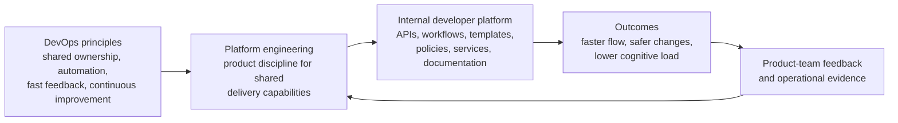
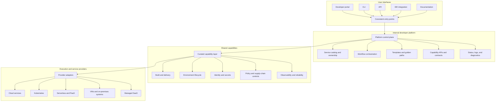
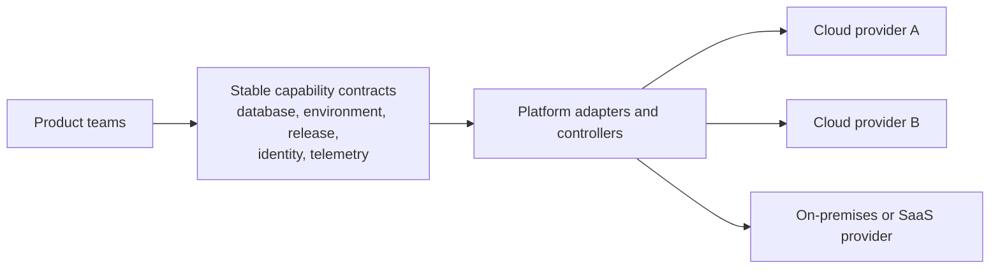
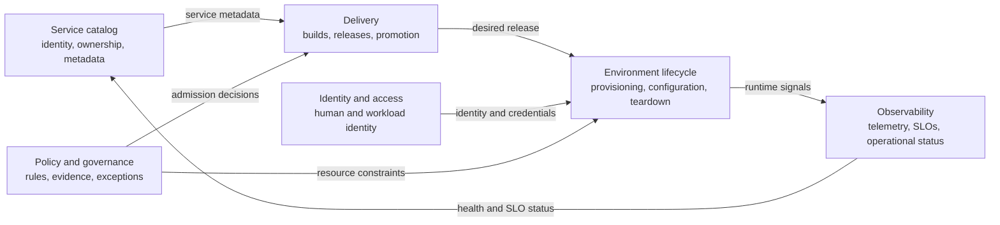
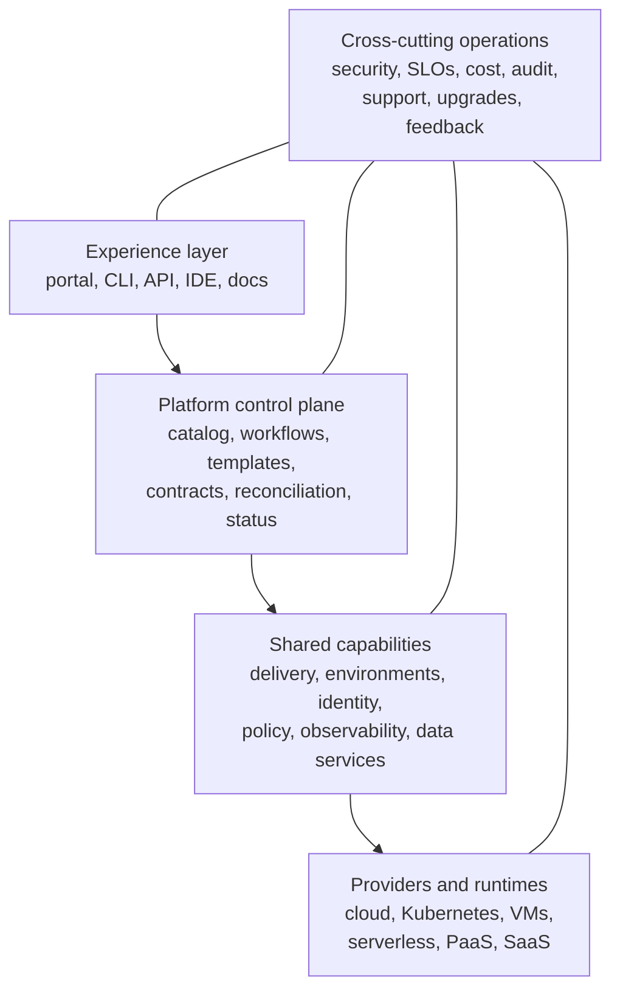
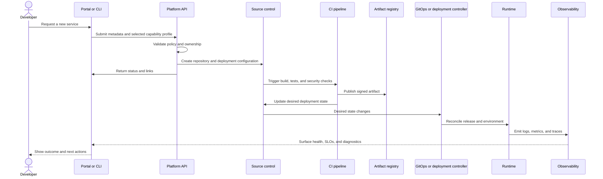
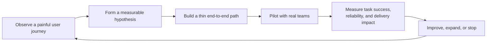

## Platform Engineering: Why It Exists and Why It Matters

Modern software delivery depends on far more than application code. Product teams also need build pipelines, deployment automation, identity, secrets, networking, policy enforcement, observability, cost controls, and reliable runtime environments. When every team assembles those pieces independently, the organization does not gain autonomy. It gains duplicated work, inconsistent controls, and a growing support burden.

Platform engineering addresses that problem by treating shared delivery capabilities as an internal product. A platform team researches recurring developer needs, builds reusable capabilities, exposes them through self-service interfaces, and operates them with the same discipline expected of any production product.

The [CNCF Platforms White Paper](https://tag-app-delivery.cncf.io/whitepapers/platforms/) emphasizes platform-as-a-product, self-service, consistent interfaces, documentation, composability, and reduced cognitive load. [DORA describes platform engineering](https://dora.dev/capabilities/platform-engineering/) as a sociotechnical discipline built around automation, self-service, repeatability, shared services, and golden paths.

> Platform engineering is the practice of making the safe, supported, and repeatable path the easiest path for internal software teams.

It is not simply a new name for operations, a Kubernetes administration team, or a portal placed in front of ticket queues. It is a product and operating model for delivering shared capabilities at scale.

## Is Platform Engineering the Evolution of DevOps?

Platform engineering is related to DevOps, but it does not replace it.

DevOps is an organizational and cultural movement concerned with collaboration, shared ownership, automation, continuous delivery, reliability, and learning. Platform engineering is one concrete way to make those principles easier to apply across many teams.

A useful distinction is:

- **DevOps provides principles and capabilities.**
- **Platform engineering packages selected capabilities into an internal product.**
- **An internal developer platform is the product that users consume.**

| Question | DevOps | Platform engineering |
|---|---|---|
| Primary concern | How teams build, deliver, and operate software together | How shared capabilities are designed, delivered, and operated as a product |
| Main unit of change | Culture, team practices, delivery system, and organizational incentives | Platform capabilities, interfaces, user journeys, and operating model |
| Typical mechanisms | Shared ownership, automation, continuous delivery, observability, learning | Self-service APIs, golden paths, templates, policy automation, service catalogs, managed capabilities |
| Desired result | Faster and more reliable delivery with better feedback | Lower cognitive load and safer autonomy across many teams |
| Common failure mode | Treating DevOps as a job title or tooling project | Building a centralized tool stack without user research or product management |

The relationship is therefore complementary. DevOps explains the operating principles. Platform engineering turns part of those principles into reusable, supported services.

## What Is a Platform, Fundamentally?

A platform is a curated set of reusable capabilities exposed through stable interfaces and operated for a defined group of users. Its purpose is to remove accidental complexity without hiding information that users need to make good decisions.

A useful platform usually combines four elements:

1. **Capabilities** - what users can do, such as creating a service, provisioning a database, deploying a release, or viewing telemetry.
2. **Interfaces** - how users consume those capabilities, such as APIs, command-line tools, portals, IDE integrations, or declarative files.
3. **Contracts** - the schemas, behavior, service levels, ownership rules, and lifecycle guarantees that make the capabilities dependable.
4. **Operations** - the reliability, support, security, cost management, upgrades, and feedback loops required after the first release.

A platform is therefore more than infrastructure. Infrastructure is one implementation layer. The platform is the user-facing product and the operating system around it.

### Internal developer platform, portal, and PaaS are not synonyms

These terms are often blurred together:

- An **internal developer platform** is the complete internal product: capabilities, APIs, automation, policies, documentation, support, and operational ownership.
- An **internal developer portal** is one possible interface into that platform. [Backstage](https://backstage.io/docs/overview/what-is-backstage/), for example, is a framework for building developer portals; it does not become a complete platform merely by being installed.
- A **platform as a service** can be a provider underneath an internal platform, or it can remove enough complexity that an organization does not need to build some platform capabilities itself.

Kubernetes can be an important provider in this architecture, but it is not a requirement. A valid internal platform may be built mostly from managed cloud services, serverless products, virtual machines, a commercial PaaS, or a combination of them.

## Why the Need for Platform Engineering Is Growing

Platform engineering is a response to recurring organizational pressure, not a reason to add another technology layer.

### 1. Delivery complexity is distributed across too many teams

Cloud infrastructure, software supply chains, identity, networking, data services, observability, and regulatory controls all evolve independently. Requiring every product team to master every layer creates delays and fragile local solutions.

A platform should absorb complexity that is common, repeatable, and not central to a product team's business domain. It should not hide essential tradeoffs or prevent a team from understanding the system it operates.

### 2. Autonomy needs guardrails

Unrestricted autonomy creates drift. Excessive central control creates queues. Platform engineering aims for a better middle ground: teams can act independently within tested defaults, while exceptional cases have an explicit escape hatch and ownership model.

Self-service does not mean the absence of control. It means that routine controls are automated, visible, and available without waiting for a person to process a ticket.

### 3. Security and compliance need to be part of the workflow

Controls applied after development become expensive handoffs. Platforms can encode identity, policy checks, artifact provenance, vulnerability scanning, approval rules, audit evidence, and environment restrictions into the normal delivery path.

The goal is not to make governance invisible at any cost. The goal is to make decisions understandable, failures actionable, and compliant behavior easier than noncompliant behavior.

### 4. Inconsistency has a compounding cost

Ten teams maintaining ten slightly different pipelines, environment models, logging conventions, and access patterns create more than ten units of work. The organization must also support every variation during incidents, migrations, audits, and staff changes.

A platform creates leverage by standardizing the common cases while preserving controlled extension points.

### 5. Faster code generation increases pressure on the delivery system

AI-assisted development can increase the rate at which code is produced, but code-generation speed does not remove bottlenecks in testing, security, deployment, or operations. [DORA's platform engineering guidance](https://dora.dev/capabilities/platform-engineering/) treats a high-quality internal platform as part of the system needed to turn local productivity gains into reliable organizational outcomes.

This is another reason to think beyond developer tooling. The relevant unit is the complete path from an idea to a safe, observable change in production.

## Treat the Platform as a Product

A platform succeeds when its users voluntarily rely on it because it improves their work. Mandates can create initial adoption, but they cannot create product fit.

A platform-as-a-product approach includes:

- clearly identified user groups and user journeys;
- a product owner or equivalent decision-making role;
- discovery interviews and observation of real delivery work;
- a roadmap tied to measurable problems rather than tool installation;
- service-level objectives for platform capabilities;
- versioned contracts and migration policies;
- documentation, examples, onboarding, and support;
- telemetry for adoption, task success, reliability, and cost;
- a contribution model that lets other teams extend the platform safely.

### Golden paths should guide, not imprison

A golden path is a well-supported way to complete a common task, such as creating and operating an HTTP service. A strong golden path is:

- opinionated enough to remove routine decisions;
- end-to-end rather than a disconnected template;
- automated and testable;
- observable, with clear status and diagnostics;
- documented with ownership and support expectations;
- composable, so advanced users can replace selected parts;
- optional where the business case for an exception is valid.

A path that users cannot leave is a golden cage. A path that offers no meaningful default is only documentation.

## Platform Engineering Through the Lens of SOLID

The [SOLID principles](https://blog.cleancoder.com/uncle-bob/2020/10/18/Solid-Relevance.html) were developed for object-oriented software design. Applying them to platform engineering is an architectural analogy, not a formal platform methodology. Used carefully, however, they provide a useful test for boundaries and contracts.

### Single Responsibility Principle

A platform capability should have one primary reason to change and a clear owner.

For example, a deployment capability may own release orchestration, rollout strategies, and deployment status. It should not also become the authoritative identity directory, cost ledger, and incident-management system. Those concerns can integrate with deployment without being absorbed into the same model.

The practical lesson is to organize the platform into coherent capabilities rather than one giant automation service.

### Open/Closed Principle

A platform should support extension without requiring every new use case to modify its core.

Useful extension mechanisms include:

- versioned templates;
- plugins;
- provider interfaces;
- policy bundles;
- reusable modules;
- event subscriptions;
- custom resources or declarative APIs;
- a documented contribution process.

Extension points need constraints. An ungoverned plugin system merely relocates fragmentation into the platform.

### Liskov Substitution Principle

Implementations advertised behind the same platform contract should preserve that contract's observable behavior.

If a `DatabaseClaim` can be fulfilled by different providers, consumers should receive compatible lifecycle behavior, credentials, backup expectations, telemetry, and service-level guarantees. Two products are not substitutes merely because both are called databases.

The lesson is to define contracts semantically, test them, and avoid pretending that incompatible services are interchangeable.

### Interface Segregation Principle

Different users need different views of the same platform.

A developer may need a simple service-creation workflow. A security engineer may need policy evidence and exception management. An operator may need health, capacity, and reconciliation controls. None of them should be forced through an interface dominated by fields and concepts they do not use.

This is why mature platforms often expose several coordinated interfaces: an API, CLI, portal, declarative configuration, dashboards, and event streams.

### Dependency Inversion Principle

Product teams should depend on stable platform capability contracts, not directly on every underlying provider API.

This reduces provider-specific coupling, but abstraction has a cost. Build an abstraction only when several consumers need a stable capability and the platform team is prepared to operate its lifecycle.

## Platform Engineering Through the Lens of Domain-Driven Design

[Domain-Driven Design](https://www.domainlanguage.com/ddd/) focuses on modeling complex domains, establishing a shared language, and making boundaries explicit. It is not a recipe for splitting a platform into microservices. Its strategic patterns are useful because internal platforms contain several models owned by different groups.

### Bounded contexts

A platform capability may deserve its own bounded context when it has distinct language, rules, data ownership, lifecycle, and expertise. Possible contexts include:

- service catalog and ownership;
- software delivery and releases;
- environment lifecycle;
- identity and workload access;
- policy and exception management;
- observability and service-level objectives;
- cost allocation and resource governance.

These are examples, not mandatory services. Several may live in one codebase, and some may be provided by teams outside the platform organization.

### Ubiquitous language

DDD's concept of a ubiquitous language is especially valuable in platform work. Terms such as `service`, `component`, `environment`, `release`, `owner`, `production`, `exception`, and `golden path` need agreed meanings.

Without that shared language, teams build integrations that appear compatible but encode different assumptions. A service catalog, for example, is only trustworthy when ownership and lifecycle states have consistent definitions.

### Context maps and ownership

A context map makes dependencies and authority visible. It should answer questions such as:

- Which system owns service identity?
- Which context declares desired deployment state?
- Which context decides whether a release is allowed?
- Where are environment lifecycle and cost policies enforced?
- Which telemetry source is authoritative for service health?

The point is not to centralize every decision. It is to make authority, translation, and integration explicit.

## A Practical Internal Developer Platform Reference Architecture

There is no universal platform blueprint. The right design depends on user needs, regulatory context, existing systems, team topology, and the organization's willingness to fund long-term operations.

A useful reference architecture has four layers plus cross-cutting concerns.

### Layer 1: Experience and interfaces

This layer meets users where they already work:

- portal;
- CLI;
- APIs;
- IDE integrations;
- declarative configuration;
- documentation and examples;
- notifications and actionable diagnostics.

A portal is useful when it improves discoverability and combines workflows. It should not become a decorative front end for manual fulfillment.

### Layer 2: Platform control plane

The control plane coordinates capabilities and preserves platform state. It may include:

- service catalog and ownership graph;
- workflow orchestration;
- software templates and scaffolding;
- platform APIs;
- reconciliation controllers;
- policy decisions and exception workflows;
- audit events;
- status aggregation.

This layer should expose durable contracts while allowing implementations below it to evolve.

### Layer 3: Shared capabilities

Common capabilities may include:

- source repository and project creation;
- build, test, artifact, and provenance workflows;
- deployment and release promotion;
- environment provisioning and teardown;
- managed data or messaging services;
- identity and secrets integration;
- observability defaults;
- traffic management;
- backup, recovery, and resilience patterns;
- cost allocation and quotas.

The platform should offer only capabilities it can support. A long catalog of unreliable features is worse than a small set of trusted ones.

### Layer 4: Providers and runtimes

The implementation layer may include:

- public cloud services;
- Kubernetes clusters;
- virtual machines;
- on-premises infrastructure;
- serverless and PaaS products;
- third-party SaaS;
- data platforms.

Provider details should be visible to platform maintainers and observable to users when relevant, but product teams should not need to understand every implementation detail for routine work.

### Cross-cutting concerns

Security, reliability, cost, telemetry, lifecycle management, documentation, and support span every layer. They are not final-stage add-ons.

### Example: a service-creation golden path

The exact tools are secondary. What matters is that the user receives a coherent workflow, clear feedback, reliable ownership, and a supported path through day-two operations.

## A Capability-First Tooling Map

Tool selection should follow the platform's product model and contracts. Starting with a list of fashionable products usually creates an expensive integration project rather than a platform.

| Capability | Common options | What to decide first |
|---|---|---|
| Source control and CI | [GitHub Actions](https://docs.github.com/actions), [GitLab CI/CD](https://docs.gitlab.com/ci/), [Buildkite](https://buildkite.com/docs) | Repository model, trust boundaries, runner isolation, artifact flow, and feedback time |
| Infrastructure as code | [OpenTofu](https://opentofu.org/docs/), [Terraform](https://developer.hashicorp.com/terraform/docs), [Pulumi](https://www.pulumi.com/docs/) | State ownership, module lifecycle, review model, drift handling, and provider support |
| Platform APIs and infrastructure control planes | [Crossplane](https://docs.crossplane.io/), custom APIs, workflow engines | Contract design, reconciliation model, composition, failure recovery, and escape hatches |
| GitOps and deployment | [Argo CD](https://argo-cd.readthedocs.io/), [Flux](https://fluxcd.io/), [Helm](https://helm.sh/docs/) | Desired-state ownership, promotion model, rollback, secrets handling, and multi-tenancy |
| Workload runtime | [Kubernetes](https://kubernetes.io/docs/home/), managed Kubernetes, serverless, PaaS, VMs | Workload needs, operational capacity, isolation, portability, and total cost |
| Policy | [Kyverno](https://kyverno.io/docs/), [OPA Gatekeeper](https://open-policy-agent.github.io/gatekeeper/website/docs/) | Where policy is evaluated, how decisions are explained, and how exceptions expire |
| Secrets integration | [Vault](https://developer.hashicorp.com/vault/docs), [External Secrets Operator](https://external-secrets.io/latest/) | Authoritative secret store, identity model, rotation, audit, and failure behavior |
| Supply-chain security | [Sigstore](https://docs.sigstore.dev/), [SLSA](https://slsa.dev/) | Artifact identity, provenance, signing policy, verification points, and evidence retention |
| Observability | [OpenTelemetry](https://opentelemetry.io/docs/), [Prometheus](https://prometheus.io/docs/introduction/overview/), [Grafana](https://grafana.com/docs/grafana/latest/), [Loki](https://grafana.com/docs/loki/latest/), [Tempo](https://grafana.com/docs/tempo/latest/) | Telemetry contracts, cardinality, retention, tenancy, cost, and ownership of alerts |
| Portal and catalog | [Backstage](https://backstage.io/docs/), [Port](https://docs.port.io/), [Cortex](https://docs.cortex.io/) | Catalog authority, metadata quality, workflow integration, extensibility, and operating cost |
| Traffic management | [Kubernetes Gateway API](https://gateway-api.sigs.k8s.io/), a maintained Gateway API implementation, cloud load balancers | Ownership boundaries, portability, policy attachment, TLS, and migration strategy |
| Service mesh | [Istio](https://istio.io/latest/docs/), [Linkerd](https://linkerd.io/2/overview/) | Whether workload identity, traffic policy, and telemetry needs justify the added complexity |
| Cost visibility | [OpenCost](https://opencost.io/docs/) and provider-native cost tools | Allocation model, unit economics, budgets, anomaly response, and user-visible feedback |

### Important tooling corrections

- **Backstage is a portal framework, not a complete internal developer platform by itself.** It can provide a catalog, templates, documentation, and integrations, but the underlying capabilities and operations still need to exist.
- **External Secrets Operator is not a secret store.** It synchronizes secrets from external providers into Kubernetes.
- **Kubernetes is optional.** Do not introduce it solely to claim that a platform is cloud native.
- **The community `ingress-nginx` controller was retired in March 2026.** Do not choose it for a new platform. The Kubernetes project recommends evaluating maintained alternatives and considering [Gateway API](https://gateway-api.sigs.k8s.io/guides/getting-started/migrating-from-ingress/). See the official [Kubernetes Steering and Security Response Committees statement](https://kubernetes.io/blog/2026/01/29/ingress-nginx-statement/).
- **A service mesh should solve a demonstrated problem.** Adding one by default increases operational and debugging complexity.

### A note about CNPE

[Certified Cloud Native Platform Engineer (CNPE)](https://www.cncf.io/training/certification/cnpe/) is a CNCF certification covering platform architecture, GitOps and continuous delivery, platform APIs and self-service, observability and operations, and security and policy enforcement. It is useful as a competency outline, but it is not a reference architecture or a prescriptive platform blueprint.

## How to Start Without Overengineering

The most common platform mistake is a big-bang program that tries to standardize the entire organization before proving value.

Start with one user group, one painful journey, and one thin vertical slice.

1. **Choose a recurring journey.** Examples include creating a service, provisioning a test environment, deploying a change, or investigating a production issue.
2. **Baseline the current experience.** Measure elapsed time, wait time, handoffs, failure rate, support effort, and user frustration.
3. **Define the smallest valuable golden path.** Include day-two needs such as updates, diagnostics, ownership changes, and teardown.
4. **Automate the controls that already matter.** Do not invent a large governance model before understanding existing risks.
5. **Pilot with real product teams.** Observe use directly instead of relying only on surveys or demos.
6. **Measure outcomes and remove friction.** Improve the path before expanding the catalog.
7. **Add extension and contribution mechanisms.** Scale the platform without making the central team responsible for every domain.

A credible first milestone might be one service template that creates a repository, configures CI, provisions a supported runtime, applies baseline policy, registers ownership, and exposes telemetry. That is more valuable than a portal containing dozens of links to disconnected tools.

## How to Measure Platform Impact

Platform metrics need to cover user experience, platform operations, and software-delivery outcomes. Adoption alone is not proof of value, especially when use is mandatory.

| Dimension | Example measures |
|---|---|
| User experience | Time to complete a key journey, task success rate, quality of failure messages, satisfaction, perceived cognitive load |
| Adoption and retention | Active teams, repeat use, voluntary adoption, abandoned workflows, use of escape hatches |
| Platform reliability | Availability, latency, reconciliation success, failed requests, recovery time, support volume, platform SLO attainment |
| Delivery performance | Change lead time, deployment frequency, failed deployment recovery time, change fail rate, deployment rework rate |
| Governance | Automated control coverage, policy-denial quality, exception lead time, expired exceptions, audit-evidence completeness |
| Economics | Unit cost per environment or service, idle-resource rate, cost anomalies, platform operating cost, duplicated-tool retirement |

[DORA's current software-delivery model](https://dora.dev/guides/dora-metrics/) uses five metrics grouped into throughput and instability. Use them at the application or service level, track trends over time, and avoid ranking teams with different contexts.

Developer productivity is multidimensional. The [SPACE framework](https://www.microsoft.com/en-us/research/publication/the-space-of-developer-productivity-theres-more-to-it-than-you-think/) is a useful reminder not to reduce productivity to commits, tickets, or lines of code.

A balanced scorecard should answer three questions:

1. Are users completing important work more easily?
2. Is the platform itself reliable and supportable?
3. Are delivery, risk, and business outcomes improving?

If the platform raises adoption while increasing change failures, support load, or user confusion, it is not succeeding. The [2024 DORA report](https://dora.dev/research/2024/dora-report/) found that internal platforms can improve productivity and organizational performance while also harming throughput or change stability when implementation reduces developer independence or adds friction.

## Common Platform Engineering Anti-Patterns

| Anti-pattern | Why it fails | Better approach |
|---|---|---|
| Tool pile | Users still assemble the workflow and diagnose integrations themselves | Design an end-to-end user journey with one ownership model |
| Portal equals platform | A polished interface hides manual fulfillment and unreliable capabilities | Build and operate the underlying APIs, automation, and services |
| Ticket-driven self-service | Forms change the appearance of the queue, not the queue itself | Automate routine fulfillment and expose status directly |
| Golden cage | Teams work around the platform when valid needs do not fit | Provide extension points, documented exceptions, and ownership transfer |
| Big-bang platform | Requirements become stale before value reaches users | Deliver a minimum viable platform and iterate with pilots |
| Kubernetes-first design | The organization inherits a complex runtime without a demonstrated need | Start from workload and user requirements, then choose providers |
| Central team owns everything | The platform becomes a bottleneck and loses domain expertise | Define federated contribution and clear context ownership |
| Adoption as the only KPI | Mandated use can conceal poor experience and worse delivery outcomes | Measure task success, reliability, delivery performance, and satisfaction |
| Abstraction without operations | The happy path works once but upgrades, incidents, and migrations fail | Fund lifecycle management, SLOs, support, and deprecation policies |

## What Good Platform Engineering Looks Like

A mature platform is not measured by how many products it integrates. It is visible in the quality of the user and operational outcomes.

Good platform engineering usually means:

- common journeys take minutes or hours instead of days of waiting;
- users receive clear, actionable feedback when work succeeds or fails;
- security, reliability, and observability defaults are built into normal workflows;
- platform contracts are documented, versioned, and tested;
- capabilities are composable and exceptions have explicit ownership;
- the platform itself has SLOs, telemetry, support, and lifecycle policies;
- product teams retain responsibility for their applications and business outcomes;
- platform adoption grows because teams experience value, not only because use is mandated;
- delivery and risk metrics improve without sacrificing developer independence.

The strongest platforms reduce cognitive load while preserving agency. They hide accidental complexity, not operational reality.

## When a Dedicated Platform Team Is Not the Right Answer

Not every organization needs a large internal platform program.

A small organization with a few teams, limited regulatory complexity, and little repeated infrastructure work may get better results from a managed PaaS, hosted CI/CD, shared templates, and a lightweight enablement function. Building a custom control plane too early creates a product that must be maintained before there is enough internal demand to justify it.

A dedicated platform investment becomes more defensible when several teams repeatedly face the same delivery constraints, local solutions are diverging, operational risk is rising, and the organization is willing to fund the platform beyond its initial launch.

The decision should be based on recurring user problems and expected leverage, not on industry fashion.

## Conclusion

Platform engineering is not a replacement for DevOps and not a synonym for Kubernetes. It is a product-oriented discipline for designing, operating, and evolving shared capabilities that help software teams deliver safely with less unnecessary cognitive load.

SOLID can provide a useful analogy for capability boundaries, extension points, contracts, and dependency direction. DDD can help teams define language, ownership, and relationships between platform domains. Neither should be applied mechanically.

The practical path is straightforward, even if the implementation is not: study a real user journey, build the smallest end-to-end improvement, embed reliable controls, measure the result, and iterate. Choose tools only after the capability and operating model are clear.

The best platform is not the one with the most features. It is the one that makes valuable work easier, failures understandable, and safe delivery repeatable.

## Further Reading

- [CNCF Platforms White Paper](https://tag-app-delivery.cncf.io/whitepapers/platforms/)
- [CNCF Platform Engineering Maturity Model](https://tag-app-delivery.cncf.io/whitepapers/platform-eng-maturity-model/)
- [DORA: Platform Engineering](https://dora.dev/capabilities/platform-engineering/)
- [DORA Software Delivery Performance Metrics](https://dora.dev/guides/dora-metrics/)
- [Backstage: What Is Backstage?](https://backstage.io/docs/overview/what-is-backstage/)
- [Kubernetes Gateway API](https://gateway-api.sigs.k8s.io/docs/introduction/)
- [Domain Language: DDD Resources](https://www.domainlanguage.com/ddd/)
- [Martin Fowler: Bounded Context](https://martinfowler.com/bliki/BoundedContext.html)
- [Microsoft Research: The SPACE of Developer Productivity](https://www.microsoft.com/en-us/research/publication/the-space-of-developer-productivity-theres-more-to-it-than-you-think/)
- [CNCF Certified Cloud Native Platform Engineer](https://www.cncf.io/training/certification/cnpe/)
- [Mermaid Documentation](https://mermaid.js.org/)
