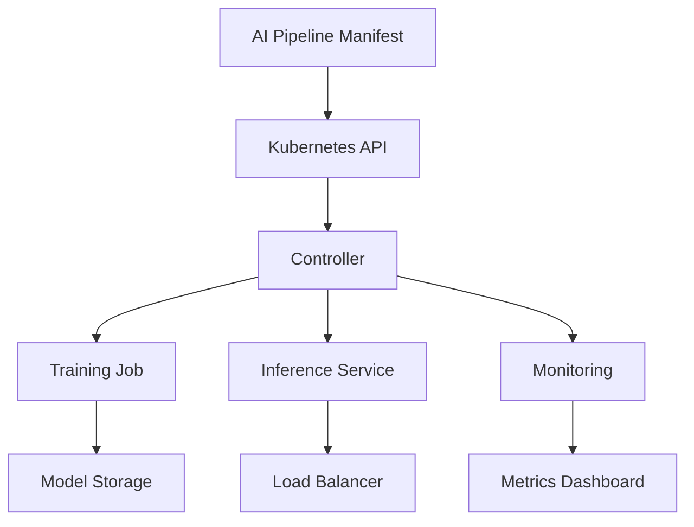
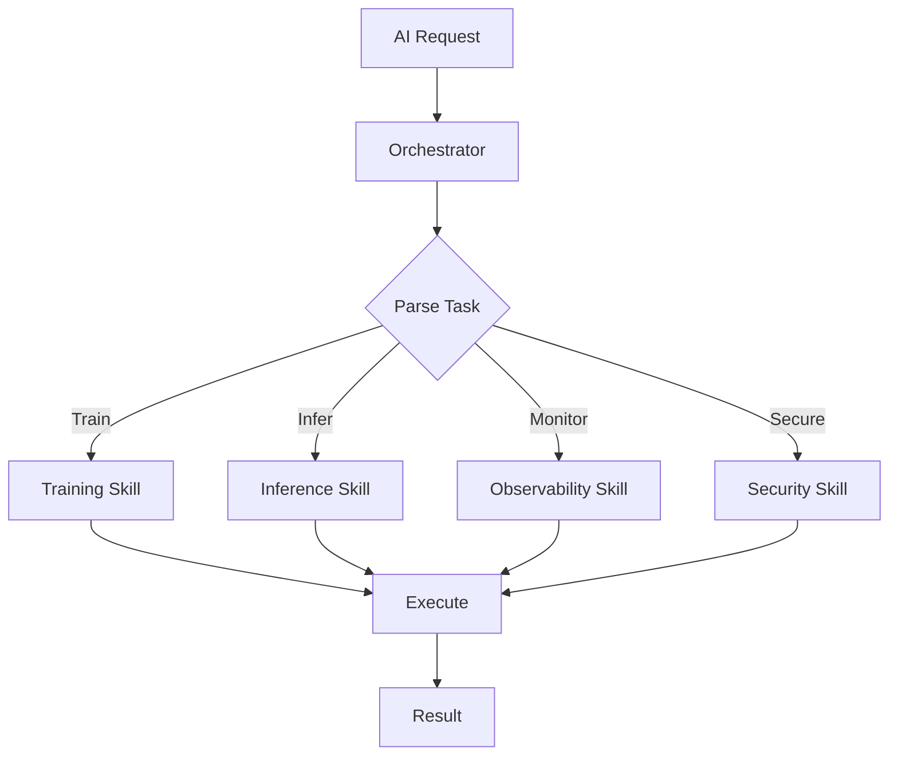

# Cloud-Native Lessons for AI: Applying Kubernetes Practices to Intelligent Systems

Cloud-native technologies like Kubernetes have transformed application deployment and management. These principles offer valuable lessons for AI implementations, enabling more robust, scalable, and efficient intelligent systems. This post explores key lessons from cloud-native environments that apply to AI, complete with use cases, academic research, and best practices for DevOps teams.

## Lesson 1: Declarative Configuration for AI Pipelines

Kubernetes' declarative approach defines desired states rather than imperative steps. In AI, this translates to defining ML pipelines as code, ensuring reproducibility and version control.

**Key Takeaway**: Use declarative manifests for AI workflows to separate concerns between what (desired outcome) and how (implementation details).

**Practical Example**: Define AI training pipelines using Kubernetes Custom Resource Definitions (CRDs), allowing operators to manage model versions and data sources declaratively.

## Lesson 2: Microservices Architecture for Modular AI

Cloud-native's microservices pattern decomposes monolithic applications into smaller, independent services. For AI, this means breaking down complex models into composable components.

**Key Takeaway**: Modular AI services improve maintainability, scalability, and fault isolation, mirroring Kubernetes' pod-based deployments.

**Practical Example**: Deploy AI inference as microservices in separate pods, enabling independent scaling of feature extraction, model serving, and post-processing components.

## Lesson 3: Observability and Monitoring for AI Systems

Kubernetes emphasizes comprehensive observability through metrics, logs, and traces. AI systems benefit from similar monitoring to track model performance, data drift, and inference latency.

**Key Takeaway**: Implement cloud-native observability patterns to ensure AI systems remain reliable and performant in production.

**Practical Example**: Use Prometheus for AI metrics collection and Grafana for dashboards visualizing model accuracy, throughput, and resource utilization.

## Lesson 4: Security by Design in AI Deployments

Zero-trust security models from cloud-native environments are crucial for AI, where models and data are valuable assets requiring protection.

**Key Takeaway**: Apply Kubernetes security practices like network policies and RBAC to AI workloads, ensuring encrypted communications and access controls.

**Practical Example**: Implement service mesh (e.g., Istio) for AI microservices to enforce mutual TLS and traffic policies between model servers and clients.

## AI Use Cases Leveraging Cloud-Native Practices

### Use Case 1: Auto-Scaling AI Inference Services

Drawing from Kubernetes HPA, AI inference can scale based on request volume, optimizing costs for variable workloads.

**Implementation**: Use AI-driven predictors with Kubernetes VPA to automatically adjust resource allocations for inference pods.

### Use Case 2: Federated Learning with Edge Deployments

Cloud-native's multi-cluster federation enables AI training across distributed environments while maintaining data locality.

**Implementation**: Deploy federated learning coordinators as Kubernetes operators, orchestrating model updates across edge clusters.

### Use Case 3: MLOps Pipelines with GitOps

GitOps principles from cloud-native CI/CD apply to ML workflows, ensuring version-controlled, auditable AI deployments.

**Implementation**: Use tools like ArgoCD to manage AI pipeline deployments, syncing desired states from Git repositories.

## Insights from Academic Research

Academic literature underscores these lessons. A 2026 arXiv paper on "Agent Name Service (ANS)" by Mittal and Cruz proposes a trust layer for AI agents in Kubernetes, addressing discovery and governance challenges.

Similarly, "C8s: A Confidential Kubernetes Architecture" by Asad et al. demonstrates how confidential computing enhances security for AI workloads, with measurable improvements in privacy guarantees.

Research on agentic AI for scientific workflows by Balis et al. shows how Kubernetes with AI agents accelerates automation in HPC environments, reducing manual overhead.

These studies conclude that AI-Kubernetes integration not only boosts performance but also enables new paradigms like sovereign AI infrastructures.

## Structuring the Skill Framework: Lessons from Practice

In structuring AI-driven orchestration frameworks, a skill-based approach using a provider-abstract kernel routes requests to domain-specific skills.

**Why This Structure Works**:
- **Abstraction**: Decouples from specific AI providers, ensuring longevity.
- **Modularity**: Skills for research, creation, analysis, and visualization compose complex tasks.
- **Safety**: Policy guardians enforce ethical boundaries.
- **Efficiency**: Direct routing minimizes latency and improves accuracy.

This mirrors Kubernetes' operator pattern, where controllers manage resources autonomously.

## Visualizing Cloud-Native AI Architectures

### Declarative AI Pipeline in Kubernetes

### Cloud-Native AI Orchestration Framework

## Text Analysis for Quality Assurance

This post maintains an educational tone, focusing on practical applications of cloud-native lessons to AI. Strengths: clear structure with lessons and examples. Risks: assumes basic Kubernetes knowledge—include introductory links. Overall, it provides actionable guidance for AI practitioners.

## Conclusion

Cloud-native lessons from Kubernetes provide a blueprint for building better AI systems. By adopting declarative configurations, microservices, observability, and security practices, teams can create more reliable and scalable intelligent applications. Academic research supports these approaches, showing measurable improvements in AI deployments. As cloud-native and AI continue to evolve together, these practices will remain essential for innovation.

Explore more DevOps insights in other posts!
