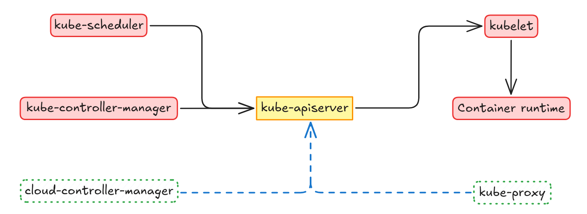

## Kubernetes architecture

While it might seem complex at first glance, the underlying architecture of Kubernetes is surprisingly elegant and in some way kind of beautiful. So, let's  try to break down this powerful container orchestration system architecture into digestible chunks, shall we?

### General architecture

First of all we have to understand that Kubernetes as a container orchestration system requires both an administration layer and a cluster for running the workloads. This way, Kubernetes separates its [core components](https://kubernetes.io/docs/concepts/overview/components/) into two mayor groups:

1. [Control Plane Components](https://kubernetes.io/docs/concepts/overview/components/#control-plane-components)
2. [Data Plane Components or Node Components](https://kubernetes.io/docs/concepts/overview/components/#node-components)

So, having these two groups separated allows for a better understanding of the required links and components that make up [Kubernetes](https://docs.kubernetes.io).

Lets try to explain Kubernetes architecture using a fairly-easy to understand metaphor (Who doesn't like metaphors to explain technical concepts?). Imagine Kubernetes as a city. It has neighborhoods (The cluster), a town hall (Control plane), and residents provide services/products (This are out of scope for this post, maybe try checking out the [Kubernetes intro](/p/kubernetes-intro) post before).

#### Control plane

Lets start talking about the Control Plane components first:

- ***kube-apiserver***: The `kube-apiserver` is the entrypoint to interacting with the Kubernetes API, its the front-end for the Kubernetes control plane. Think of it as the recepcionist at town hall, every request targeting the town hall should go through the reception. This component is designed to scale horizontally (Deploy new instances) so its usual to have a load-balancer to access the **kube-apiserver** by distributing traffic between multiple different instances.

- ***etcd***: To store data [`etcd`](https://etcd.io/) is used, this is a key-value distributed database that allows to store cluster's desired state so that nodes can get to the desired state. You can think of this as the city's webpage where they publish operations they must do.

- ***kube-scheduler***: This component is in charge of deciding where do containers (Applications or components) need to run, taking into account different topics like resource requirements and other constraints. Think of it as a job agency where given some constraints (Availability, skills, knowledge, etc.) it helps people (containers) find their way into a job.

- ***kube-controller-manager***: This component is in charge of running controllers, before explaining what a controller is, lets first think of the `kube-controller-manager` as a mall. Just like a shop in a mall specializes in selling a certain type of product or providing a particular service, a controller in Kubernetes manages a specific aspect of the cluster's state. Each controller focuses on its own area, working independently but contributing to the overall health and operation of the cluster, much like how individual shops contribute to the overall function of the mall. You can find the different controllers Kubernetes provides [here](https://github.com/kubernetes/kubernetes/tree/master/pkg/controller).

- *cloud-controller-manager*: This is a component not necessary for Kubernetes to actually work in a very basic sense, but it's absolutely essential for integrating Kubernetes with cloud providers. Think of it like a specialized manager in charge primarily of operations with external actors. In case there's no external requirements, Kubernetes can still operate. Just as a reference, you can read the docs on [how](https://kubernetes.io/docs/tasks/administer-cluster/developing-cloud-controller-manager/) to create a [`cloud-controller-manager`](https://kubernetes.io/docs/concepts/architecture/cloud-controller/) implementation.

#### Node components

- ***kubelet***: This component is in charge of allowing `kube-apiserver` to manage nodes on the cluster (Worker nodes specifically). The man job of Kubelet is acting as an interface so that `kube-apiserver` can communicate with the `container runtime` in a standardized way. The Kubelet is not officially well-documented but recently I went through a really cool tool called [**kubeletctl**](https://github.com/cyberark/kubeletctl) that provides a [list](https://github.com/cyberark/kubeletctl/blob/master/API_TABLE.md) of the available methods the API provides.

- ***Container-runtime***: This component is not specific to Kubernetes but it's necessary to be able to run containerized workflows and so it acts as a dependency for Kubernetes. As long as a container runtime implements [CRI](https://medium.com/@dmosyan/container-runtime-interface-explained-1c3c5af07eaf), Kubernetes can talk to it.

- *kube-proxy*: This is a component not necessary for Kubernetes to actually work but the main idea it implements is in fact. This component is in charge of actually routing the requests to the containers they need to go to based on filtering. If the network plugin that cluster is going to use does provide that low-level filtering then the `kube-proxy` is not necessary.

#### Communication

It's important to notice that Kubernetes allows for fault tolerance and so high availability is supported and recommended when setting up the cluster, also [`etcd`](https://etcd.io/) can be installed separated from the control-plane (Only requires network connectivity with control-plane).

To understand communication flow, first let's take a look at communication within the control plane. The API server acts as the central hub, and so all other control plane components, such as the `kube-scheduler` and the `kube-controller-manager`, communicate with the API server to both receive updates about the cluster state and to publish their own actions. For example, the scheduler watches the API server for new pods that need to be scheduled, and the controller manager watches for changes in the desired state of resources (like deployments or services) and takes action to reconcile the actual state with the desired state.

The `cloud-controller-manager` communicates with the API server to learn about changes in the cluster state and then interacts with the cloud provider's APIs to implement those changes.  This allows Kubernetes to seamlessly integrate with the underlying cloud infrastructure, dynamically provisioning and managing resources as needed.  Essentially, it bridges the gap between the Kubernetes API and the cloud provider's control plane.

Next, consider the communication between the control plane and the worker nodes.  The kubelet, which runs on each worker node, first communicates with the API server to register the node and report its status. The API server, in turn, communicates with the kubelet to instruct it to start, stop, or update containers. This communication typically uses HTTPS and is secured.

Optionally, the `kube-proxy` which also runs on each worker node, manages network rules for services. It communicates with the API server to learn about new services and updates the local network rules accordingly.

Finally, let's examine communication between pods. Pods can communicate with each other within the cluster using their IP addresses. Services provide an abstraction layer on top of pods, allowing pods to be discovered and accessed more easily.  When a pod wants to access a service, it typically uses the service's virtual IP address (VIP) and port. `kube-proxy`, using the network rules it has learned from the API server, then routes the traffic to the appropriate backend pods.

### Conclusion

Understanding these core components is crucial for effectively using Kubernetes.  By thinking of Kubernetes as a city with interconnected parts, we can make this powerful system less intimidating and more accessible. Stay tuned for future posts where we dive deeper into specific aspects of Kubernetes!
