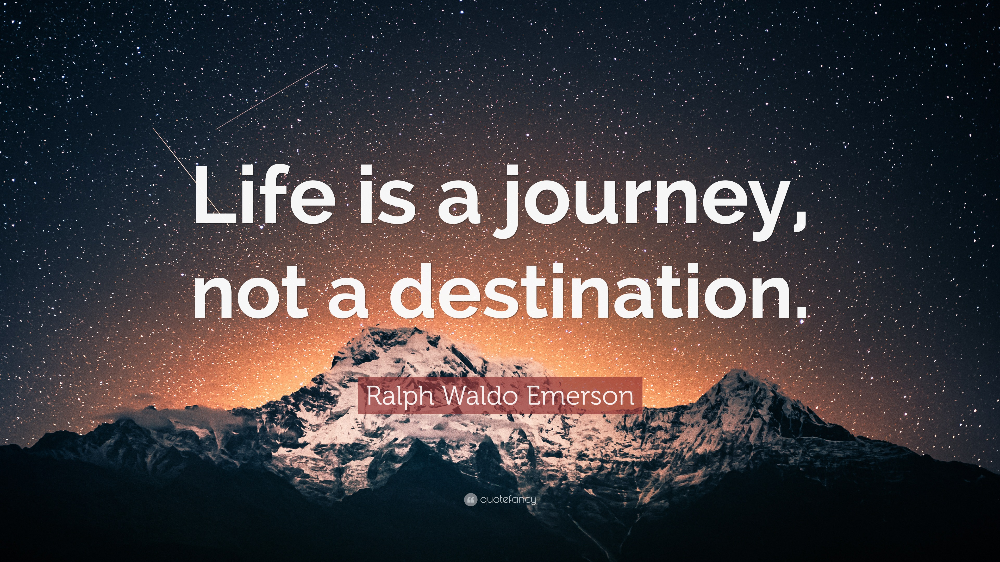
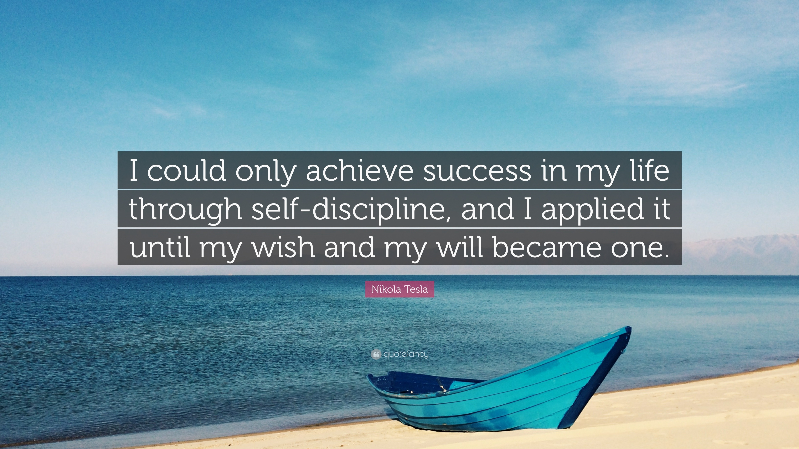

> ***NOTE*** \
> This post is  only my opinion and so should be taken into account carefully.

## The value of following a complex learning path and why certifying is more than a title

### Why certifying is more than a title

I'm not gonna try and give you an absolute truth about what success is because I don't know really if there's something like an absolute truth on something and I understand that's quite an opinion, but I'm gonna take the risk of you believing my opinion has no real-value (*I really don't care if you do, I don't do this for any recognition*).

[Wikipedia](https://en.wikipedia.org/wiki/Success) defines success like this:
> Success is the state or condition of meeting a defined range of expectations. It may be viewed as the opposite of failure. The criteria for success depend on context, and may be relative to a particular observer or belief system.

I like that definition because it states success is something personal and in my opinion that's exactly what it is. Now, I'll continue this post stating that to me success is just meeting some internal expectations.

Different people say different things about what fuels success: some say discipline, some say passion, some say pain. Those are really interesting ideas, however I believe that the fuel to success is often a mix of internal and external drivers.

- **The internal**: curiosity, purpose, hunger to grow, the need to prove to yourself that you can, etc.
- **The external**: money, recognition, urgency, expectations, opportunity, etc.

Both matter. And that balance is deeply personal.

Now, following that mindset I want to say that learning can become a really powerful tool because it can act as a mechanism to help you find what drives you, not what people say drives you. So in this sense, certifications aren’t just about passing a test or getting a badge, it's a deliberate challenge to help you find your way towards success.

And I understand that's quite weird to read but sometimes it's not about actually achieving something but more the path you followed towards that goal.



#### A journey of self growth

Now we've hopefully gotten to a point where the value of learning isn't defined just as a way of learning something new but more to understand yourself and a mechanism to just know you better.

So, as a quick summary here, lets just say that learning is one of the most powerful acts of self-respect. It transforms you from someone reacting to life into someone shaping it. It’s not about chasing perfection or external approval, it’s about developing awareness. And once you have that, you realize: You're only limited by time, not by capacity.

#### Finding the motivation

Finding *why you're doing something* is probably just as important as doing it.

If you have your motivations clear, if you understand what’s really pushing you forward, then it’s way more likely that you’ll finish what you started. You’ll have something to come back to on the hard days. Something that anchors you when the path gets murky because it reminds you that the struggle has purpose.

Motivation is personal and can be fueled by different drivers. If you take time to understand yours, you’re not just chasing a goal, you’re building a path that’s actually worth walking. I'm gonna guide you through two of what I believe are two powerful motivation sources and why do I believe it:

##### People

People can be powerful sources of motivation. Sometimes it’s the ones who believe in you, even when you don’t fully believe in yourself, the ones that cheer you on, that lift you when you’re doubting, that see your effort even when the outcome isn’t perfect. Other times, it’s the people quietly watching you grow, letting you know that you’re not alone in the journey.

But motivation doesn’t always come from kindness. Sometimes, it comes from the opposite.

People will try to put you down eventually. That’s just how it is. Maybe your growth reminds them of where they’re stuck, maybe you’re not playing the role they want you to, maybe they’re just not comfortable with who you are or maybe they just don’t see you clearly and that’s *their* lens. Don't let it become *your* truth.

And for sure, people will always have something to say, especially when you’re being authentic, doing good, or making an effort. But their words don’t neccessarily define you. They don’t pay your bills, live your life, or walk in your shoes. So why give them that power? Let them talk. Just be you.

The key is not letting their noise drown out your signal. You don’t need to shrink to make others comfortable. You don’t need to dim your light so someone else can pretend theirs is brighter. Let them do their thing. You keep being *you*. And if they aren't comfortable with that, honestly? It's not your problem. It’s not worth your time.

##### Money

Some take a journey because of the money they receive when completing it. It's a valid motivation as everything else can be, sometimes you believe more money equals more happiness or you just have a motivation that you firmly believe money can help you achieve and that's perfectly fine really. I don't think there's anything wrong in using money as a motivation.

Money often represents possibility, freedom, self-respect. Wanting a better life, more options, or security is not greedy. Ambition can be a really powerful driver so don't diminish it.

#### Is motivation enough?



Well, I decided to include this section to try and avoid any communication issues. Motivation on its own is just a set of reasons you have to do something but really it takes more than motivation to do something, I'm not trying to say something like *if you're afraid just do it scared* because being scared is natural and in the past I tried doing things scared but it didn't work out well, it was just like something didn't feel right, so I'm not gonna talk about something I can't relate.

What works to me tho is discipline, knowing I have to do something and just persist in the journey towards achieving that goal even when things don't seem to be working is what keeps me moving forward.

#### The learning process


Not everyone is a "read-the-docs-and-instantly-get-it" person. People are different being different is just different not wrong. Some people learn by building, others by teaching and some need to fail before they can even figure out the right question to ask.

In a way, this is similar to **Howard Gardner’s theory of multiple intelligences**, a theory that states there are multiple types of intelligences:

- Logical
- Interpersonal
- Spatial
- Musical
- Linguistic
- Kinesthetic

We often overvalue the analytical kind of person and forget that empathy, intuition, and creativity are just as essential to understanding the world and ourselves.

### Kubernetes and my journey following a practical learning path

The first time I saw Kubernetes, I found it overwhelming and even boring but sometimes life just gives me challenges and I've learned to face them no matter what.

Eventually, after breaking clusters more times than I could probably count, things started clicking. I began to understand why things worked the way they did. I started seeing patterns, connecting concepts. That’s when it hit me: Kubernetes isn’t just a tool, it’s more like a mindset. It teaches you how to think in terms of systems. How to design for failure. How to orchestrate complexity without losing your mind. And somewhere along the way, it also taught me something I had lost a long time before *how to trust myself again*.

In that sense, ***Kubernetes*** gave me more than technical knowledge. It gave me clarity, confidence and a deeper respect for both distributed systems and for myself. And really, looking retrospectively, that's the reason I really started my journey towards becoming a *Kubestronaut*.

#### Challenges in my journey

Before proceeding I just want to remember
> Life is a journey, not a destination

##### KCNA (Kubernetes and Cloud Native Associate)

Yeah, some would say this isn't even a challenge so why bother reading what I consider a challenge? If you think like that, you're free to skip to the [next exam](#ckad).

For those of you who stayed tho, I have to say that I found this exam to be challenging because of the multiple things it focuses on, sure it's probably not as challenging as other exams in this list but it's challenging in its own way.

So, you want to know what I did to prepare myself for completing this? Well, I studied the course on **Kodekloud**, read through a lot of documentation and watched a lot of Youtube videos.

##### CKAD (Certified Kubernetes Application Developer)

Looking retrospectively, *just my opinion *eas* a man who already passed this exam*, this exam was not as challenging as someone would expect. The fact that this exam was practical really scared me to the point that I really couldn't sleep the night before the exam because I couldn't stop thinking on the worst case scenario, and its funny because one of the things I scared the most actually happened at the moment of taking the exam: my ***UI froze***. Yeah I lost like ten minutes there that I believe would have helped me get a higher score but on the other hand I kind of lost that sense of anxiety in taking exams with that format. Understand YAML and learn to work with the CLI, also knowing VIM shortcuts will help you a lot.

Ok, but how exactly did I prepare? I did made the **Kodekloud** course, as well as some other courses there that I believe were important to cover all domains exam was targetted at, but also I read a lot of documentation, watched a lot of videos and what I would say was the most important thing was practicing in **Killercoda** and **Killer.sh**.

Nobody mentioned here is paying me so this is my honest opinion: **Kodekloud** is a great platform, it offers interesting courses that kind of guide you to what you need to learn (They do teach, clearly, it's just that sometimes you need more detail to really understand *or that's probably just me*) and sometimes their courses don't adapt to the environment as fast as it changes but that's OK really, it's a great platform I don't want you to believe it's not worth it because it is.

Adding more here, **Killercoda** and **Killer.sh** are worth every second of the time you spend on them. Exercises on **Killercoda** are free with an account and **Killer.sh** does cost but with the exam purchases you get two scenarios (Really just one exam but in two different environments) that mimic a lot the real exam feel. Also, I really enjoy feedback and what better than at the end having the possibility to access detailed step-by-step instructions on *one way to tackle each question (The real value here is on explanations I believe)*.

##### CKA (Certified Kubernetes Administrator)

Was this challenging? Sure it was. Having the lessons learned from the last exam I took, I uninstalled from my PC many programs in an attempt to avoid any weird resource consumption or maybe background processes coming up during my exam, I also manually stopped many things before the exam so I was confident everything was gonna be just fine (And it was).

Again, I did almost the same I did for the [CKAD](#ckad) but this time **Kodekloud** had not a lot of content on some of the newer topics on the exam so reading through the docs was something I made more for my preparation here.

##### KCSA (Kubernetes and Cloud Security Associate)

Again, this might not be as challenging as other exams on this list but it was challenging just like [KCNA](#kcna).

Well, what I did here was kind of weird. I made **Kodekloud**'s course and read many documentation but I also watched some CNCF talks not exactly on **Kubernetes** but more on a cloud-security oriented fashion. My thinking was *This exam is theorical, so probably they aren't gonna ask me how to do X or Y in K8S but more like why would I do X or Y in K8S*, also I wanted to prepare for the scenario where they asked me in a more cloud-agnostic way to explain a security-related topic. At the end, was my preparation useful? Well, In some way it was, but that sure was useful for [CKS](#cks) and learning is useful always.

##### CKS (Certified Kubernetes Security Specialist)

Ok, first of all, yes, I admit I was scared of this exam, I had heard really bad things about the exam. Was it so hard and challenging? No, it sure was challenging but it's not impossible.

I decided on taking this exam as the last one in my journey towards becoming a Kubestronaut hoping to have more time to prepare for it than for the other exams as well as other reasons like CKA being a prerequisite and that I wanted to take KCSA and CKS one after the other. Well, looking retrospectively that was a good decision not because I learned everything I needed, but because it allowed me to feel more confidence in myself and that was really a valuable thing for this exam.

I took my preparations like I did with [CKA](#cka) and refreshed everything from [KCSA](#kcsa) but also read a fantastic book I received and watched fantastic videos on the topics the exam covered. The exam is challenging but not something you can't deal with and passing it (At least for me) felt so rewarding that I would go through all again.

> **EDIT**: Yep, I decided to continue ...
##### LFCS (Linux Foundation Certified Sysadmin)
Ok, this one was a special one. I've been looking to do a Linux-related exam long before I learnt about Kubernetes (Actually Linux introduced me to containers and that eventually got me into Kubernetes so that's another reason this one was special). So suited with my Kubestronaut jacket I just took the exam.

Well, what I did for this one? I think that practicing was the most important thing I did. But funny or not, I repeated what I did for [CKA](#cka) and I really enjoyed it.

##### KCA (Kyverno Certified Associate)
I like security, it's not what I do the most but I like it anyway mainly because I enjoy understanding things at a deep level and security in a way relates to that. Hopefully one day I'll do it more profesionally. That's why this was great, not only because I could learn more about a wonderful project, but because security is great.

At the time I was preparing for this exam I couldn't find a lot of preparation for it but let me just state how great the documentation of this project is and Nirmata (The company that backs this project) has also a great YouTube channel that explains topics really well.

##### ICA (Istio Certified Associate)
Ok, I had like some inner-thoughts when preparing for this and so decided to move on and return to this exam later. I didn't attempt it and eventough I know its and important topic, I just wasn't sure that doing this before some of the others was the best idea.
> I'll see you soon, just hang in there a little more.

##### CCA (Cilium Certified Associate)
Well, **Cilium** is a fantastic project. I really didn't knew that much about it, but I just loved the experience of understanding it.

Well, for this one I was really into practicing and verifying that everything I learnt theorically worked the same practically. I took almost the same I did for [CKA](#cka) but I gave an **emphasis** on practicing (Apart from [Isovalent's channel](https://youtube.com/@isovalent), I'm grateful for [Nico Vibert's](https://youtube.com/@nicovibert))

##### PCA (Prometheus Certified Associate) 
##### OTCA (OpenTelemetry Certified Associate)
##### CGOA (Certified GitOps Associate)
##### CAPA (Certified Argo Project Associate)
##### CBA (Certified Backstage Associate)
##### CNPA (Certified Cloud Native Platform Engineering Associate)

### Tips for Taking (Kubernetes) Exams — Lessons from the experience

Taking technical exams is like deploying in production: you can’t panic, and you need to trust your setup. Technical certification exams (Ok, maybe not all but exams like LFCS, CKA, CKAD and CKS) usually have some type of hands-on scenarios. That means mindset, preparation, and tactics all matter.

Let’s break down some tips for test-taking, mapped to how things work in Kubernetes.

#### Stay stateless: Don’t attach yourself to a single question

- **K8s analogy**: Pods are ephemeral. They crash, they restart. You don’t panic, just reschedule.
- **Exam tip**: If you get stuck on a question, don’t cling to it. Mark it, move on, and come back later, most exams today have a mechanism to review questions later, use that. Staring at a problem won't magically produce clarity. Momentum matters. Keep the node healthy (Here, your mind is the node).

#### Design for failure: You **will** make mistakes

- **K8s analogy**: Kubernetes doesn’t assume perfection. It assumes things will fail and it automates recovery.
- **Exam tip**: You're going to typo a command. You're going to forget a flag. That’s normal. Don't waste mental energy punishing yourself. Learn to recover fast. Practice ```Ctrl+C```, ```arrow keys```, and ```up-arrow``` like you're piloting a spaceship. Being resilient under pressure is a superpower.

#### Use probes: Know when you’re healthy

- **K8s analogy**: Liveness and readiness probes keep Kubernetes honest. If a service isn’t ready, K8s doesn’t route traffic to it.
- **Exam tip**: Know your limits. If you're too tired, anxious, or hungry, you're not "ready." Create rituals before the exam: hydrate, stretch, breathe. Self-monitoring keeps your brain in a ready state, just like a container.

#### Use volumes: Save what matters

- **K8s analogy**: Volumes let data persist across pod lifecycles.
- **Exam tip**: Don’t try to hold everything in RAM things can crash, offload to disk. For Kubernetes exams, use the Notepad or built-in text editor to:
  - Store YAML skeletons
  - Keep handy kubectl flags, write down important things, question numbers, or what you skipped

#### Know your tools: kubectl, grep, watch, vim/nano, etc

- **K8s analogy**: The CLI is your API. You’re not just a user—you’re an orchestrator.
- **Exam tip**: Practice like you’ll perform. Tools are your toolbox, not your crutches. Get deeply comfortable with:
  - kubectl get all -n NAMESPACE
  - kubectl describe
  - kubectl logs
  - kubectl explain <-- This is extremely helpful really
  - Autocomplete (```TAB```) and reverse search (```Ctrl+R```)

#### Namespace Your Focus

- **K8s analogy**: Namespaces separate concerns. They keep things isolated, manageable.
- **Exam tip**: Don’t let one bad pod (question) ruin the whole cluster (exam). Segment and contain. Timebox yourself. Create mental namespaces:
  - 0–40 mins: Fast wins
  - 40–100 mins: Medium-difficulty tasks
  - Final 20 mins: Backtrack and polish

#### ReplicaSets: Practice multiple times

- **K8s analogy**: Replication increases resilience.
- **Exam tip**: Learning from multiple angles increases retention and makes your knowledge more fault-tolerant. Don’t rely on one study source. Use:
  - Killer.sh (simulates real exam pressure (At least it did for me))
  - Kubernetes docs (the official exam guide)
  - Katacoda, Play with K8s, or Minikube for hands-on labs
  - YouTube walkthroughs (but recreate them yourself)

#### Don’t over-provision your brain

- **K8s analogy**: Over-provisioned nodes waste resources and risk failure under load.

- **Exam tip**: Don’t try to memorize every command or flag. Focus on understanding patterns. For example:
  - Usually resources have a spec.
  - Most kubectl commands follow a format: kubectl VERB RESOURCE NAME -n NAMESPACE
  - Logs and events are your best friends when something breaks.

Think in mental templates, not trivia.

#### Check your cluster: Read the questions carefully

- **K8s analogy**: You don’t apply manifests blindly, you check context: namespace, labels, dependencies.
- **Exam tip**: Many candidates fail not because they don’t know the answer but because they don’t read the question fully, remeber rushing causes misconfigurations. Understand:
  - Which namespace you’re working in
  - What resource kind is requested
  - Whether you’re expected to create, modify, or debug

#### Deploy with confidence

- **K8s analogy**: Once everything is ready, you apply and let the system do its thing.
- **Exam tip**: When you’ve reviewed your work, trust yourself. Hit submit. Don’t second-guess every line of YAML. Sometimes confidence is what carries you through more than knowledge.

### Final thoughts

Certifying as a Kubestronaut isn’t just about Kubernetes. It’s about learning how to think in systems, how to recover quickly, and how to move forward with clarity. It’s about resilience, awareness, and rediscovering your own capability of accomplishing things.

So if you’re walking a similar path, keep going. The badge isn’t the point. Becoming someone who earned it is.  If you can survive a failing pod in production, you can survive a tough 2-hour exam. And when you walk out with that badge, you'll know it wasn't luck, it was all orchestration.
