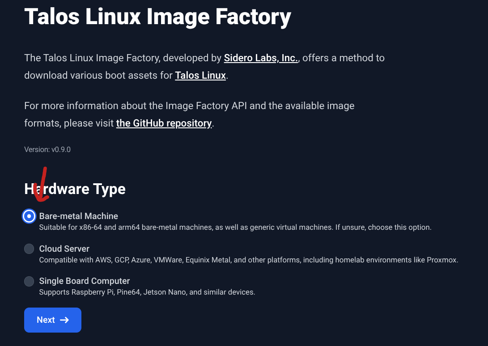
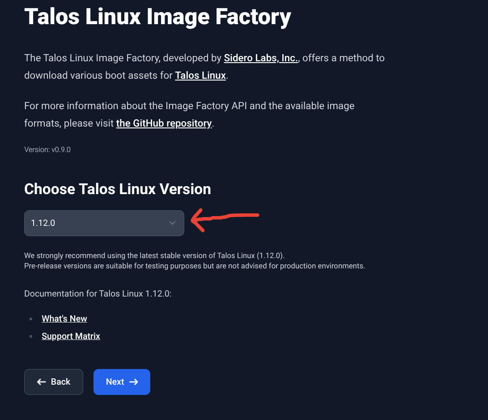
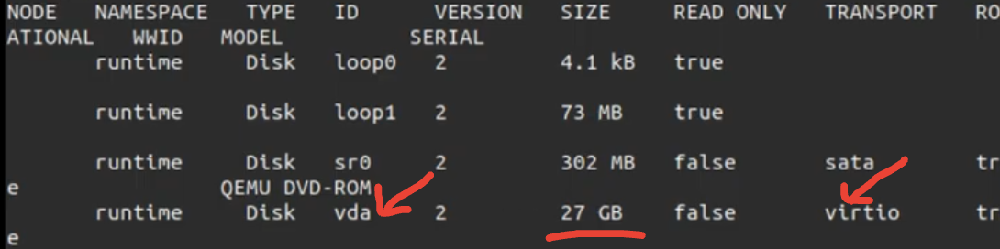
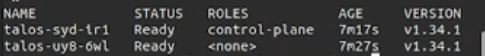

## Deployment of Talos OS

Now I know that for deploying Kubernetes clusters, there are many options available, there's applications like [kind](https://kind.sigs.k8s.io/), [microk8s](https://microk8s.io/), [minikube](https://minikube.sigs.k8s.io/), [k3s](https://k3s.io/), [kubeadm](https://kubernetes.io/docs/setup/production-environment/tools/kubeadm/install-kubeadm/), and managed services like [EKS](https://aws.amazon.com/eks/), [GKE](https://cloud.google.com/kubernetes-engine), and [AKS](https://azure.microsoft.com/en-us/services/kubernetes-service/) that make it easy to get started.

I've had experience with most of these tools, but there's always a problem: You have to either pay for maintenance (That's like the idea of managed-services) or maintain things yourself (Like with applications, services and that kind of stuff), so as I wanted to experiment I didn't really care about maintaining things for myself, but I wanted it to be simple. Now, the applications that I mentioned before intended to run Kubernetes are well that: _applications_ and I don't want to use the [OSI model](https://en.wikipedia.org/wiki/OSI_model) here, but you have to maintain more things if you run an application, these are designed to run on top of an operating system that is meant to run one or more applications. This was a problem to me because well I didn't want to do all that maintenance work instead of dedicating that time to Kubernetes, so after some research I found out there was an option named **Talos OS** that was exactly what I was looking for, an OS meant to just run Kubernetes.

Now, you might be wondering:
> Didn't you have like other options?

There's [RancherOS](https://rancher.com/docs/os/v1.x/en/), [Flatcar Linux](https://www.flatcar-linux.org/) and [Fedora CoreOS](https://www.redhat.com/en/technologies/cloud-computing/openshift/what-was-coreos). But I chose **Talos OS** mainly because it's meant to only run Kubernetes and it also has other features that I found great for solving my problem. I'm not saying that the other OSes aren't great, but for my use case Talos was probably the best fit.

Should I spend time explaining what Talos OS is? Maybe a little bit.

So, to make it simple: Let's say that Talos OS is a minimal and immutable operating system designed specifically for running Kubernetes. It is designed to provide an efficient platform for deploying and managing Kubernetes clusters/workloads. Some of its key features include:

- **Minimalism**: Talos OS is stripped down to the essentials needed to run Kubernetes, reducing the attack surface and resource consumption.

- **Immutability**: The OS is designed to be immutable, meaning that it cannot be modified after deployment. This helps ensure consistency and reliability across cluster nodes.

- **API-Driven**: Talos OS is managed entirely through an API, allowing for automated and programmatic (Also CLI-driven) control over the operating system and Kubernetes cluster.

Now, you might be wondering _ok this is great but please define what do you mean by _essentials_?_ Look no further, I've got an answer for you. When I say "essentials", I mean that Talos OS includes only the components necessary to run Kubernetes, such as the container runtime, networking stack, and basic system utilities. It does not include unnecessary packages or services that are not required for Kubernetes operation like package managers. When I did my experiment counting the number of files inside the `/bin` directory gave me a total of 38 files, which is pretty minimal compared to other operating systems. Now you might be thinking _Ok, you mentioned there's no packages that aren't needed to run Kubernetes and I think that means there's no shell, so, how in the blue blazes did you count the number of files inside `/bin`?_ Good question, I did that by actually counting the files that a Talos VM had on its disk: I mounted the disk on another Linux machine (That had the neccessary tools) and counted the files from there since Talos OS doesn't have a shell.

The same goes for immutability. In the context of Operative Systems, eventough immutability has a lot of interpretations, it basically means that the OS is designed to not be modified after deployment. In Talos' case, this means that the base operating system can't be modified, but there's some layers on top that in fact can (But not for everything). For example, you can modify the Kubernetes configuration, some network settings, and some other parameters through the Talos API, but you cannot modify the underlying OS components.

Great, so now that we know what Talos OS is (At least a bit), let's proceed to the [deployment steps](https://talos.dev/docs). You should know there's a lot of ways to deploy Talos OS: you can use bare-metal servers, containers, virtual machines, cloud providers ... . For this tutorial, I'll be using virtual machines with [QEMU](https://www.qemu.org/) and [KVM](https://linux-kvm.org/page/Main_Page) as the hypervisor. Why? Because it's free and open-source, and I can run it on my Linux machine without any problem. Why not containers then? I did that but I really think that using VMs gives you a more realistic experience of running Talos OS, plus, it allows you to experiment with different configurations and settings that might not be possible in a containerized environment. Can I use other hypervisors like VirtualBox, VMware, Hyper-V ... ? Yes, you can. The steps will be similar, but the commands and configurations might differ slightly depending on the hypervisor you choose. Why not cloud providers? I want to have the ability to interact with the platform running my OS to show certain things. Can I combine multiple deployment mechanisms together? Yes, you can for example run the control plane nodes on bare-metal servers and the worker nodes on virtual machines or cloud providers, as long as they can communicate with each other there should be no problems.

Ok, enough talking. Let's get our hands dirty and deploy Talos OS!

1. Download Talos OS ISO image from the [image factory website](https://factory.talos.dev/): Here you select the hardware where you want to deploy Talos OS, in our case we will select `Bare-metal` as the hardware target. choose the latest available version (As of writing this tutorial, the latest version is `v1.12.0`), then select the architecture of the target machine (Most likely `amd64` for x86_64 machines). Finally, click on the `Download` button to download the ISO image.




2. Create virtual machines for the control plane and worker nodes. For this tutorial, we will create one control plane node and one worker node. You can use Virt-Manager in case you want a UI experience, i like the terminal so use the following commands to create the VMs using QEMU/KVM:

```bash
# As root or with sudo privileges because we will be using virsh commands
# Create network bridge
cat <<EOF > talos-net.xml
<network>
  <name>talos</name>
  <bridge name="talos-bridge" stp="on" delay="0"/>
  <forward mode='nat'>
    <nat/>
  </forward>
  <ip address="10.0.0.1" netmask="255.255.255.0">
    <dhcp>
      <range start="10.0.0.2" end="10.0.0.254"/>
    </dhcp>
  </ip>
</network>
EOF
virsh net-define talos-net.xml
virsh net-start my-talos-net
# Create control plane node
virt-install \
  --virt-type kvm \
  --name control-plane-1 \
  --ram 2048 \
  --vcpus 2 \
  # Configure the disk for the VM
  --disk path=control-plane-1-disk.qcow2,bus=virtio,size=30,format=qcow2 \
  # Replace with the path to the downloaded ISO image (Note that this attaches a CD-ROM drive to the VM)
  --cdrom metal-amd64.iso \ 
  --os-variant=linux2024 \
  # The network we previously created
  --network network=talos \
  # The boot order (Important) and no autoconsole to avoid issues
  --boot hd,cdrom --noautoconsole

# Create worker node
virt-install \
  --virt-type kvm \
  --name worker-1 \
  --ram 4086 \
  --vcpus 2 \
  # Configure the disk for the VM
  --disk path=worker-1-disk.qcow2,bus=virtio,size=40,format=qcow2 \
  # Replace with the path to the downloaded ISO image (Note that this attaches a CD-ROM drive to the VM)
  --cdrom metal-amd64.iso \
  --os-variant=linux2024 \
  # The network we previously created
  --network network=talos \
  # The boot order (Important) and no autoconsole to avoid issues
  --boot hd,cdrom --noautoconsole
```

3. Generate Talos OS configuration files for the control plane and worker nodes using the `talosctl` command-line tool and apply them. You can use the following commands to generate and apply the configuration files:

```bash
# Set environment variables for the IP addresses of the VMs (To avoid rewriting them manually each time)
export CONTROL_PLANE_IP=$(virsh domifaddr control-plane-1 | egrep '/' | awk '{print $4}' | cut -d'/' -f1)
export WORKER_IP=$(virsh domifaddr worker-1 | egrep '/' | awk '{print $4}' | cut -d'/' -f1)
# Install talosctl if you haven't already
curl -Lo talosctl https://github.com/talos-systems/talos/releases/latest/download/talosctl-linux-amd64
chmod +x talosctl
sudo mv talosctl /usr/local/bin/
# Generate configuration for control plane node
# It's important to identify on which disk we want to install Talos OS, usually when we use the virtio bus, the disk is /dev/vda (At least for me) but you should verify that on your own. Run the following command to check the disks available on the node and identify the correct one (Probably the larger one):
talosctl  get disks --nodes $CONTROL_PLANE_IP --insecure
# Now generate the configuration files
talosctl gen config my-cluster https://${CONTROL_PLANE_IP}:6443 --install-disk /dev/vda -o configs/
# After generating configurations, we have to apply them so that Talos OS can be installed on the VMs
talosctl apply-config --insecure --nodes $CONTROL_PLANE_IP --file configs/controlplane.yaml
talosctl apply-config --insecure --nodes $WORKER_IP --file configs/worker.yaml
```



4. Bootstrap ETCD (Only for the first control plane node and one time):

```bash
# In case your session restarted and the environment variables are lost, you can set them again like this:
export CONTROL_PLANE_IP=$(virsh domifaddr control-plane-1 | egrep '/' | awk '{print $4}' | cut -d'/' -f1)
export WORKER_IP=$(virsh domifaddr worker-1 | egrep '/' | awk '{print $4}' | cut -d'/' -f1)

# Now, since communication to the Talos API is encrypted we need to provide the configuration file to talosctl so it can communicate with the nodes
export TALOSCONFIG=$(realpath configs/talosconfig)
# Now define who talosctl should communicate with:
talosctl config endpoint $CONTROL_PLANE_IP
talosctl -n $CONTROL_PLANE_IP bootstrap
```


5. After some time (Bootstraping can take a while), you should be able to access the Kubernetes cluster using `kubectl`. To do this, you need to get the kubeconfig file from the control plane node and set it up on your local machine:

```bash
# Get kubeconfig file from control plane node
talosctl -n $CONTROL_PLANE_IP kubeconfig > $PWD/configs/kubeconfig
# Set KUBECONFIG environment variable to use the kubeconfig file
export KUBECONFIG=$PWD/configs/kubeconfig
# Verify that you can access the cluster
kubectl get nodes -o wide
```



Yep, I ommited some really cool details like **System extensions** (Talos' way of installing additional software on the nodes), **A/B upgrades**, **Partitions** and other cool stuff, but this is just a basic tutorial to get you started with Talos OS. You can find more information about these topics in the [official Talos OS documentation](https://talos.dev/docs/). And also I would like to invite you to explore more about Talos OS and its features, as it has a lot to offer for running Kubernetes clusters efficiently and securely.

Was this tutorial helpful? Do you have any questions or suggestions? Feel free to leave a comment. Happy clustering!
