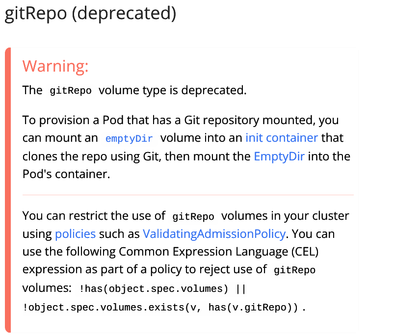

## CVE-2024-10220: Arbitrary command execution through gitRepo volume ISSUE#128885

### Definition (What is this about?)

As stated on the [issue on Github](https://github.com/kubernetes/kubernetes/issues/128885) raised by Kubernetes to explain this  
> A security vulnerability was discovered in Kubernetes that could allow a user with the ability to create a pod and associate a gitRepo volume to execute arbitrary commands beyond the container boundary. This vulnerability leverages the hooks folder in the target repository to run arbitrary commands outside of the container's boundary.

### Importance (Why is knowing about this vulnerability important?)

Kubernetes has become the de facto standard for container orchestration, simplifying the deployment and management of containerized applications. In that order of ideas knowing about this vulnerability is important as Kubernetes is a technology used frequently on the Industry and getting to know threats you might face allow you to prepare better than someone that is just unaware of what can actually happen.

### Review / analysis

First, it's important to notice that the Kubernetes gitRepo volume was deprecated because of some design-inherent security problems and using an init container to clone a Git repository inside a volume and then mount that to a Pod that needs it is now the recommended approach. 

### Mitigations (What can I do?)

The most crucial mitigation is to immediately stop using the gitRepo volume type. Because it's deprecated and inherently insecure. Do not use it in any new deployments, and if you have existing deployments that rely on it, migrate away as soon as possible.

Also you can implement this measures:

* **Keep Kubernetes Up to Date**: Regularly update your Kubernetes clusters to the latest patched versions to benefit from security fixes.
* **Implement Strong RBAC**: Use Role-Based Access Control to restrict user privileges and limit the potential impact of a compromised account.
* **Regular Security Audits**: Conduct regular security audits of your Kubernetes configurations and deployments to identify vulnerabilities.
* **Implement correct security context according to application:** ```securityContexts``` allow you to define security settings at the pod or container level.  They provide fine-grained control over permissions and access (Also you can define a [seccompProfile profile](https://kubernetes.io/docs/tutorials/security/seccomp/) that allows filtering for specific system calls).

### Update 12/26/24

Recently I found this blog [entry](https://www.armosec.io/blog/kubernetes-cloud-native-cves-2024/#:~:text=Description%3A%20A%20security%20flaw%20in,by%20associating%20a%20gitRepo%20volume) it ennumerates multiple vulnerabilities related to [CNCF](https://cncf.io) so probably you will find that reading to be interesting.
